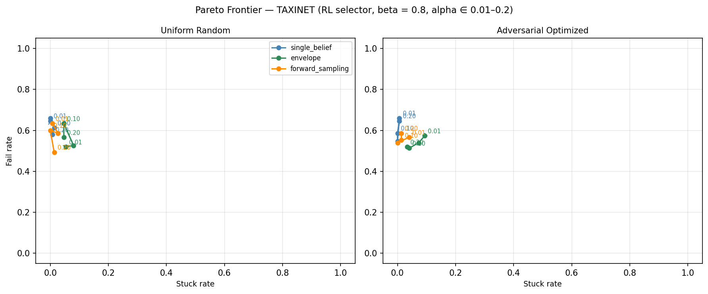

# Alpha Sweep: TaxiNet Pareto Frontier

Sweep of the Clopper-Pearson significance level `alpha` ∈ {0.01, 0.05, 0.10, 0.20}
for `single_belief`, `envelope`, and `forward_sampling` shields, RL selector,
both perception regimes. Shield threshold held fixed at `beta = 0.8`.

`alpha` controls the width of the Clopper-Pearson intervals used to build the
perception IMDP: smaller `alpha` → wider intervals (more uncertainty acknowledged,
more conservative shielding); larger `alpha` → tighter intervals (more permissive
shielding). The same IPOMDP infrastructure is reused for every alpha, so this is
a clean 1D scan along the interval-width axis.

**Total runtime**: 25.5 min (cached RL agents and adversarial realizations from a
prior 148 min sweep run; this re-run only added the new `forward_sampling`
evaluations).

**Settings**: 4 alphas × 5 seeds × 30 trials × 20 steps × 3 shields × 2 perception
regimes = 360 MC evaluations. Forward-sampling shield uses `budget=500`,
`K_samples=100`.

**Limitation**: Adversarial-optimized perception realizations are trained against
the `envelope` shield at the fixed `beta = 0.8` and reused for all three shield
evaluations. This may under-estimate the worst case for `single_belief` and
`forward_sampling`.

---

## Summary



*Left: uniform-random perception. Right: adversarial-optimized perception.
Blue = `single_belief`, green = `envelope`, orange = `forward_sampling`.
Annotations show the alpha value; arrows point from the lowest to the next-lowest
alpha along each curve.*

---

## Uniform perception

<table>
<thead>
<tr><th>alpha</th>
    <th>sb fail%</th><th>sb stuck%</th>
    <th>env fail%</th><th>env stuck%</th>
    <th>fs fail%</th><th>fs stuck%</th></tr>
</thead>
<tbody>
<tr><td>0.01</td><td>65%</td><td>0%</td><td>52%</td><td>5%</td><td>63%</td><td>1%</td></tr>
<tr><td>0.05</td><td>66%</td><td>0%</td><td>53%</td><td>8%</td><td>59%</td><td>3%</td></tr>
<tr><td>0.10</td><td>61%</td><td>1%</td><td>63%</td><td>5%</td><td>60%</td><td>0%</td></tr>
<tr><td>0.20</td><td>58%</td><td>1%</td><td>57%</td><td>5%</td><td><b>49%</b></td><td>1%</td></tr>
</tbody>
</table>

- `forward_sampling` at alpha = 0.20 achieves the lowest fail rate of any
  shield/alpha combination under uniform perception (49% fail / 1% stuck),
  Pareto-dominating both `single_belief` and `envelope` at the same alpha.
- `single_belief` collapses to near-zero stuck across all alphas but pays for
  it in fail rate (58–66%).
- `envelope` carries a consistent 5–8% stuck overhead regardless of alpha; its
  fail rate moves erratically with alpha (52% → 63% → 57%) — the across-seed
  std is ≈ 10 pp, so this jitter is on the edge of noise.

## Adversarial perception

<table>
<thead>
<tr><th>alpha</th>
    <th>sb fail%</th><th>sb stuck%</th>
    <th>env fail%</th><th>env stuck%</th>
    <th>fs fail%</th><th>fs stuck%</th></tr>
</thead>
<tbody>
<tr><td>0.01</td><td>66%</td><td>1%</td><td>57%</td><td>9%</td><td>57%</td><td>4%</td></tr>
<tr><td>0.05</td><td>55%</td><td>0%</td><td>54%</td><td>7%</td><td>54%</td><td>0%</td></tr>
<tr><td>0.10</td><td>59%</td><td>0%</td><td><b>51%</b></td><td>4%</td><td>55%</td><td>1%</td></tr>
<tr><td>0.20</td><td>65%</td><td>1%</td><td>52%</td><td>3%</td><td>59%</td><td>1%</td></tr>
</tbody>
</table>

- `envelope` minimises fail (51% / 4% stuck at alpha = 0.10) but at a small
  stuck premium.
- `forward_sampling` tracks `envelope` on fail (within ≈ 3 pp at every alpha)
  while keeping stuck near zero — the most balanced operating point.
- `single_belief` has a U-shaped fail curve in alpha (best at the centre,
  worst at the extremes) but never matches the other two shields.

---

## Key observations

1. **Forward-sampling is the new Pareto frontier on TaxiNet.** Under uniform
   perception it dominates both other shields at alpha = 0.20 (49% fail, 1%
   stuck). Under adversarial perception it matches `envelope` on fail while
   spending ≈ 3–6 pp less stuck.
2. **Alpha has a small effect compared to shield choice.** Across the four
   alpha values, per-shield fail rates move within a ~10 pp band while the
   gap between shields is consistently larger. The two-stage takeaway:
   *first* pick the shield, *then* tune alpha.
3. **No single best alpha.** `envelope` benefits from intermediate alpha
   (0.10), `single_belief` from intermediate alpha (0.10–0.20),
   `forward_sampling` from extremes (alpha = 0.20 under uniform; alpha = 0.05
   under adversarial). The shields disagree on which alpha is best, reflecting
   their differing sensitivity to interval width.
4. **Statistical caveat.** Per-seed std is 4–14 pp on fail rate (n = 5 seeds
   × 30 trials per cell), comparable to the cross-alpha spread. Most alpha
   trends within a single shield are on the edge of significance; the shield
   ordering is more robust than the alpha ordering.

## Reproducibility

```
python3 -m ipomdp_shielding.experiments.sweeps.rl_alpha_sweep
# config: ipomdp_shielding/experiments/sweeps/rl_alpha_sweep_taxinet.py
# outputs: data/sweep/rl_alpha_taxinet/{results_tidy.csv, sweep_summary.json, figures/pareto_alpha.png}
```

Tidy CSV: `results/alpha_sweep/results_tidy.csv`
JSON summary (full metadata + per-alpha aggregates): `results/alpha_sweep/sweep_summary.json`
