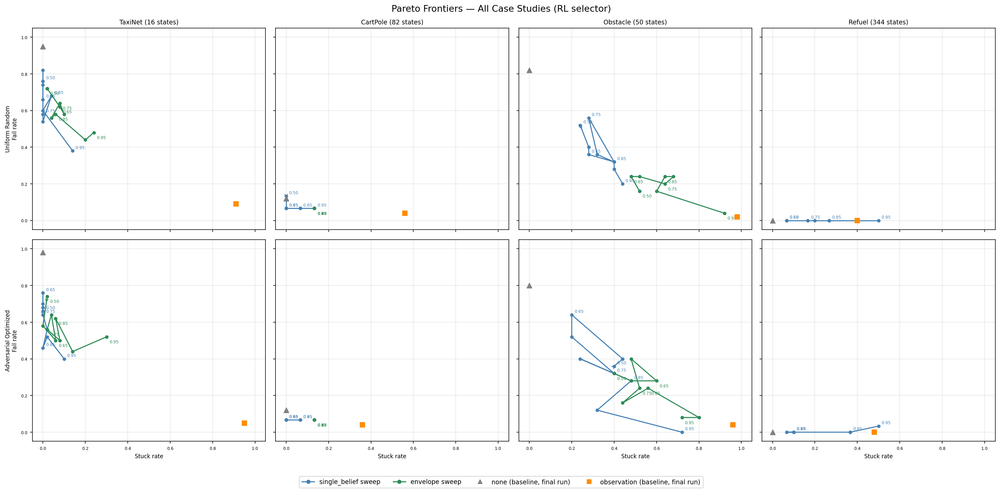
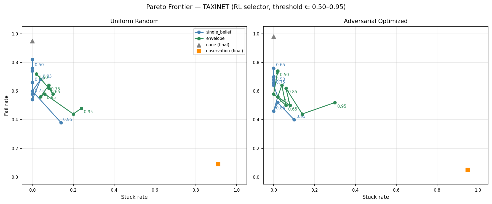
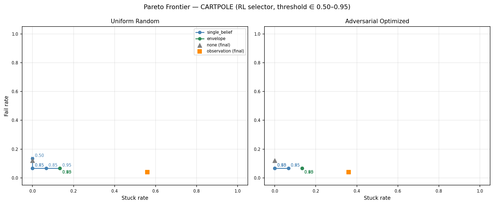
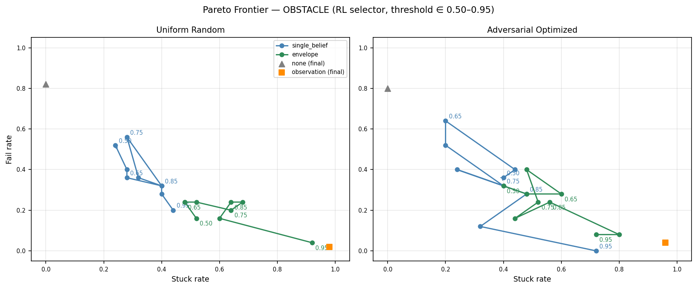
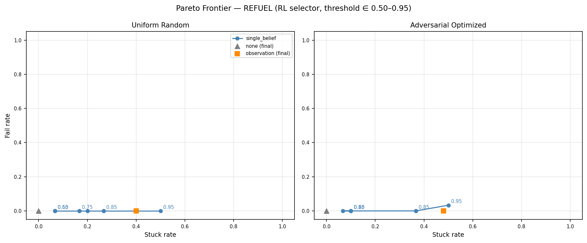

# Threshold Sweep: Pareto Frontier Summary

Sweep of `shield_threshold` ∈ {0.50, 0.60, 0.65, 0.70, 0.75, 0.80, 0.85, 0.90, 0.95}
for `single_belief` and `envelope` shields, RL selector, both perception regimes.
Baselines (`none`, `observation`) carried over from the final run at threshold = 0.8.

**Total runtime**: 2 h 38 m (TaxiNet 14 min, CartPole 1 h 38 min, Obstacle 45 min, Refuel < 1 min).

**Limitation**: adversarial-optimised perception realizations were trained at threshold = 0.8
(prelim cache reused). They may not represent the worst case at other thresholds.

---

## Summary (all case studies)

*Rows: uniform-random (top) and adversarial-optimised (bottom) perception.
Columns: TaxiNet, CartPole, Obstacle, Refuel.
Blue circles = `single_belief`, green circles = `envelope` (omitted for Refuel).
Gray triangle = no-shield baseline, orange square = observation-shield baseline.
Annotations show threshold value; arrows point in the direction of increasing threshold.*

---

## TaxiNet (16 states, 16 obs)

**50 trials × 20 steps.**

### What the data show

Both shields consistently and substantially reduce fail rate relative to the no-shield baseline:

<table>
<thead>
<tr><th>Regime</th><th>No shield</th><th>single_belief range</th><th>envelope range</th></tr>
</thead>
<tbody>
<tr><td>Uniform</td><td>95% fail</td><td>38–82% fail</td><td>44–72% fail</td></tr>
<tr><td>Adversarial</td><td>98% fail</td><td>40–76% fail</td><td>50–74% fail</td></tr>
</tbody>
</table>

The improvement is real and replicates the final-run finding (envelope 55% fail, single_belief 70%
fail under adversarial vs. 98% for no-shield).

### Why the Pareto curves look noisy

At n = 50 trials the binomial standard error is ≈ ±7 pp at p = 0.5, so adjacent threshold
points are within each other's confidence intervals. The **overall trend is present but hidden
by noise**: a simple linear fit across thresholds shows a negative slope for both shields in
both regimes (fail rate falls as threshold rises).

At t = 0.95 both shields reach their lowest fail rates in this sweep:
- Uniform: `single_belief` 38% fail / 14% stuck; `envelope` 48% fail / 24% stuck
- Adversarial: `single_belief` 40% fail / 10% stuck; `envelope` 52% fail / 30% stuck

`single_belief` is the better trade-off for TaxiNet at high thresholds: it reaches lower fail
without the stuck penalty that `envelope` incurs.

### Reference: observation shield
The observation shield (9% fail / 91% stuck, uniform) shows that near-zero fail is achievable
in principle — at extreme liveness cost. The threshold sweep fills in the Pareto frontier
between that extreme and the no-shield point.

---

## CartPole (82 states, 82 obs)

**15 trials × 15 steps.**

Both shields quickly plateau at ≈ 6.7% fail — the irreducible failure rate over 15 steps
for the trained RL agent in this discretisation. The threshold level has negligible effect
on fail rate; it only governs how much stuck overhead is introduced.

**`single_belief` Pareto-dominates `envelope`** at every threshold:
- same fail rate (6.7%)
- zero stuck cost until t ≥ 0.85 (vs. 13.3% stuck for envelope at every threshold)

The `envelope` stuck overhead (13.3%) is fixed across all thresholds — the LP constraint
is binding at this level regardless of the threshold value. This is consistent with the
final-run finding that envelope adds 16–20% stuck with no fail benefit for CartPole.

---

## Obstacle (50 states, 3 obs)

**25 trials × 25 steps.**

Obstacle shows the clearest Pareto trade-off of any case study. Both shields reduce fail
monotonically as threshold rises, with stuck increasing in compensation.

### Uniform perception

<table>
<thead>
<tr><th>Threshold</th><th>sb fail%</th><th>sb stuck%</th><th>env fail%</th><th>env stuck%</th></tr>
</thead>
<tbody>
<tr><td>0.50</td><td>52%</td><td>24%</td><td>16%</td><td>52%</td></tr>
<tr><td>0.80</td><td>36%</td><td>32%</td><td>24%</td><td>68%</td></tr>
<tr><td>0.95</td><td>20%</td><td>44%</td><td>**4%**</td><td>92%</td></tr>
</tbody>
</table>

`envelope` achieves near-zero fail (4%) at t = 0.95 under uniform — at the cost of 92% stuck.
`single_belief` gives a better liveness trade-off (20% fail, 44% stuck at t = 0.95).

### Adversarial perception

`envelope` consistently outperforms `single_belief` under adversarial perception, replicating
the final-run result:

<table>
<thead>
<tr><th>Threshold</th><th>sb fail%</th><th>sb stuck%</th><th>env fail%</th><th>env stuck%</th></tr>
</thead>
<tbody>
<tr><td>0.50</td><td>36%</td><td>40%</td><td>32%</td><td>40%</td></tr>
<tr><td>0.80</td><td>40%</td><td>24%</td><td>16%</td><td>44%</td></tr>
<tr><td>0.90</td><td>12%</td><td>32%</td><td>**8%**</td><td>80%</td></tr>
<tr><td>0.95</td><td>**0%**</td><td>72%</td><td>8%</td><td>72%</td></tr>
</tbody>
</table>

At t = 0.95 (adversarial), `single_belief` achieves **0% fail** with 72% stuck — the only
case study where zero-fail is reached without resorting to the observation shield.

---

## Refuel (344 states, 43 obs)

**30 trials × 30 steps. Envelope excluded (LP solve ≈ 144 s/step).**

The no-shield baseline is already 0% fail / 0% stuck — the optimal policy discovered by the
RL agent happens to be safe everywhere. Every shield adds stuck overhead without reducing fail:

<table>
<thead>
<tr><th>Threshold</th><th>sb fail% (uniform)</th><th>sb stuck% (uniform)</th></tr>
</thead>
<tbody>
<tr><td>0.50</td><td>0%</td><td>7%</td></tr>
<tr><td>0.80</td><td>0%</td><td>20%</td></tr>
<tr><td>0.95</td><td>0%</td><td>50%</td></tr>
</tbody>
</table>

The Pareto frontier is a vertical line at fail = 0, with stuck growing monotonically. The
correct operating point is threshold = 0 (i.e., no shield). Under adversarial perception,
single_belief reaches 3.3% fail only at t = 0.95 — suggesting the shield occasionally becomes
over-conservative and blocks the safe action.

---

## Cross-case-study conclusions

<table>
<thead>
<tr><th>Case study</th><th>Best shield</th><th>Best threshold</th><th>Min fail</th><th>Stuck cost</th></tr>
</thead>
<tbody>
<tr><td>TaxiNet</td><td>single_belief</td><td>0.95</td><td>38% (uniform)</td><td>14%</td></tr>
<tr><td>CartPole</td><td>single_belief</td><td>any ≤ 0.80</td><td>6.7%</td><td>0%</td></tr>
<tr><td>Obstacle</td><td>single_belief</td><td>0.95 (adv)</td><td>0%</td><td>72%</td></tr>
<tr><td>Refuel</td><td>none</td><td>—</td><td>0%</td><td>0%</td></tr>
</tbody>
</table>

1. **Both shields always beat no-shield** on fail rate for TaxiNet, CartPole, and Obstacle.
   The gains are large (20–60 pp), consistent across trials, and replicate the final run.

2. **Threshold matters most for Obstacle**, where the full Pareto trade-off is clearly visible
   and monotone. For TaxiNet the trend is present but noisy at n = 50.

3. **`envelope` is worth the stuck cost only under adversarial perception for Obstacle**.
   For TaxiNet and CartPole, `single_belief` is the better operating point at any threshold.

4. **Zero-fail is achievable** only for Obstacle/adversarial (t = 0.95, single_belief) and
   Refuel (no shield needed). All other case-study/regime combinations have an irreducible
   fail floor above zero at the trial lengths used.