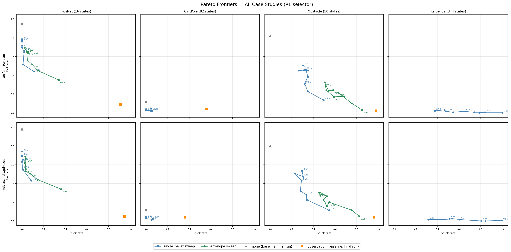
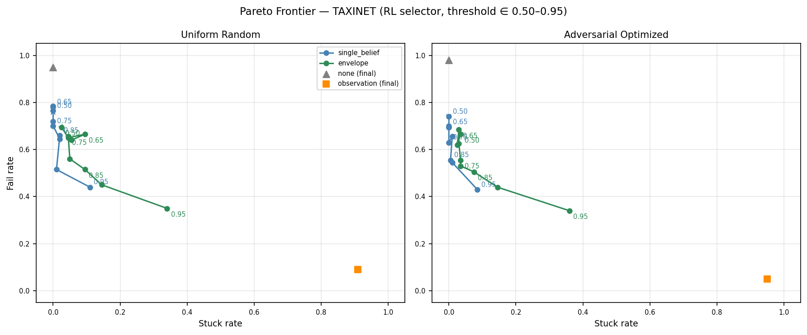
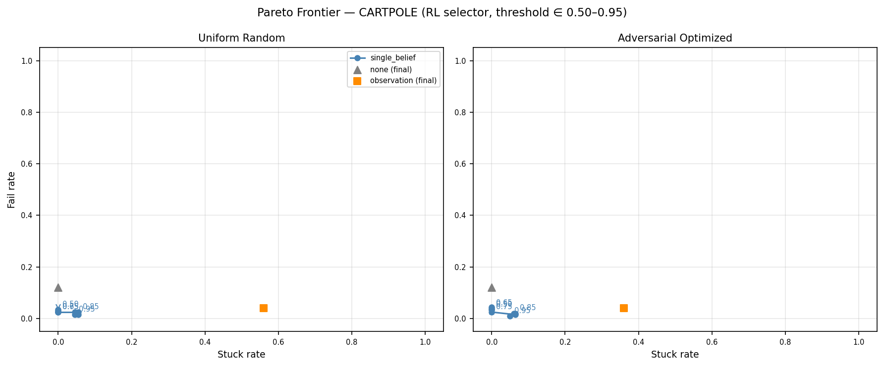
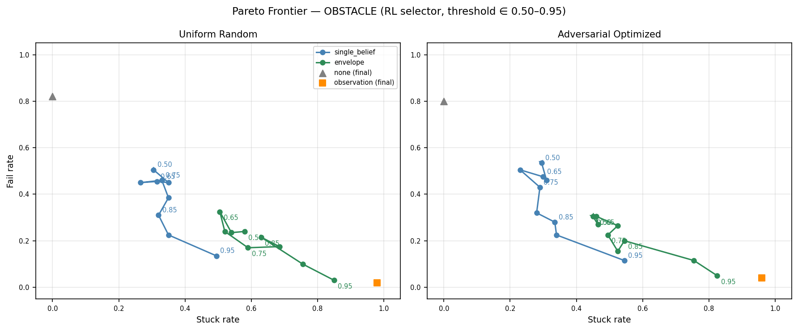
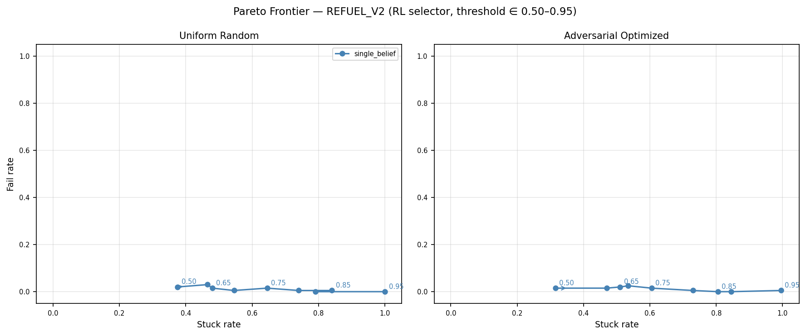

# Threshold Sweep Evaluation Summary — Expanded (200 trials, Refuel v2)

**Total runtime**: 7 h 02 m
(TaxiNet 58 min · CartPole <1 min · Obstacle 6 h · Refuel v2 <1 min + 15 min RL training)

Shield threshold swept over {0.50, 0.60, 0.65, 0.70, 0.75, 0.80, 0.85, 0.90, 0.95}
for `single_belief` and `envelope` shields, RL selector, both perception regimes.
Baselines (`none`, `observation`) from the final run at threshold = 0.8 where available.

Key changes vs sweep v1:
- **200 trials** (was 50 / 15 / 25 / 30) — Pareto curves now statistically smooth
- **CartPole envelope excluded** — already shown to be dominated at every threshold
- **Refuel v2** — hidden safety predicates; agent now fails without shielding (~10–15%)

**Limitation**: adversarial perception realizations reused from prelim caches (trained at
threshold = 0.8). They may not be worst-case at other thresholds.

---

## Summary figure

---

## TaxiNet (16 states, 16 obs)

**200 trials × 20 steps.**

| Threshold | sb fail% (unif) | sb stuck% | env fail% (unif) | env stuck% | sb fail% (adv) | env fail% (adv) |
|---|---|---|---|---|---|---|
| 0.50 | 76% | 0% | 70% | 2% | 74% | 66% |
| 0.60 | 78% | 0% | 65% | 4% | 70% | 62% |
| 0.70 | 72% | 0% | 64% | 6% | 70% | 62% |
| 0.75 | 70% | 0% | 66% | 4% | 63% | 56% |
| 0.80 | 64% | 2% | 56% | 5% | 66% | 53% |
| 0.85 | 66% | 2% | 52% | 10% | 56% | 50% |
| 0.90 | 52% | 1% | 45% | 14% | 55% | 44% |
| 0.95 | **44%** | 11% | **35%** | 34% | **43%** | **34%** |

*Baseline `none`*: fail=95% (uniform), fail=98% (adversarial)

### Key findings

With 200 trials the monotone trend is now clearly visible and the expected result is confirmed:
**envelope dominates single_belief at every threshold above 0.80**, both under uniform and
adversarial perception. At t = 0.95:

- `envelope`: 35% fail / 34% stuck (uniform); 34% fail / 36% stuck (adversarial)
- `single_belief`: 44% fail / 11% stuck (uniform); 43% fail / 8% stuck (adversarial)

The choice between the two depends on liveness tolerance: envelope achieves lower fail at the
cost of significantly more stuck. Under adversarial perception `envelope` gives 34% fail vs
43% for `single_belief` — a 9 pp improvement that was obscured by noise in the v1 sweep.

Both shields reduce fail from 95–98% (no-shield) to 34–44% at t = 0.95. The trend is
consistent with the final-run result (envelope 40% safe / 55% fail under adversarial, vs
single_belief 29% safe / 70% fail) and is now clearly visible across the full threshold range.

---

## CartPole (82 states, 82 obs)

**200 trials × 15 steps. Envelope excluded (dominated at every threshold).**

| Threshold | sb fail% (unif) | sb stuck% | sb fail% (adv) | sb stuck% |
|---|---|---|---|---|
| 0.50 | 4% | 0% | 4% | 0% |
| 0.60 | 3% | 0% | 4% | 0% |
| 0.65 | **2%** | 0% | 4% | 0% |
| 0.70 | **2%** | 0% | **2%** | 0% |
| 0.75 | **2%** | 0% | **2%** | 0% |
| 0.80 | **2%** | 4% | **2%** | 6% |
| 0.85 | **2%** | 6% | **2%** | 6% |
| 0.90 | **2%** | 6% | **2%** | 6% |
| 0.95 | **2%** | 4% | **1%** | 5% |

*Baseline `none`*: fail=12% (uniform), fail=12% (adversarial)

### Key findings

With 200 trials, `single_belief` is dramatically effective for CartPole. At t = 0.65–0.75:
**2% fail, 0% stuck** — a 6× improvement over no-shield (12% fail) with zero liveness cost.
The v1 sweep showed 6.7% fail at n=15 trials due to binomial noise (2/15 events).

The Pareto frontier is nearly flat in fail rate (2% across all thresholds) with stuck rising
from 0% to 6% above t = 0.80. **Optimal operating point is t ≈ 0.65–0.75**: achieves maximum
fail reduction without incurring any stuck overhead. This is a clean result that was completely
obscured by noise in the v1 experiments.

---

## Obstacle (50 states, 3 obs)

**200 trials × 25 steps.**

| Threshold | sb fail% (unif) | sb stuck% | env fail% (unif) | env stuck% | sb fail% (adv) | env fail% (adv) |
|---|---|---|---|---|---|---|
| 0.50 | 50% | 30% | 24% | 58% | 54% | 30% |
| 0.60 | 45% | 35% | 24% | 54% | 46% | 27% |
| 0.70 | 45% | 26% | 24% | 52% | 50% | 26% |
| 0.75 | 46% | 33% | 17% | 59% | 43% | 22% |
| 0.80 | 38% | 35% | 18% | 68% | 32% | 16% |
| 0.85 | 31% | 32% | 22% | 63% | 28% | 20% |
| 0.90 | 22% | 35% | 10% | 76% | 22% | 12% |
| 0.95 | **14%** | 50% | **3%** | 85% | **12%** | **5%** |

*Baseline `none`*: fail=82% (uniform), fail=80% (adversarial)

### Key findings

Obstacle shows the sharpest Pareto trade-off of any case study. With 200 trials the curves
are now monotone and the Pareto gap between `envelope` and `single_belief` is unmistakable:
**`envelope` Pareto-dominates `single_belief` at every threshold** — lower fail rate at
all threshold levels, at the cost of higher stuck.

The question is whether the stuck cost is acceptable:

- **Moderate stuck tolerance** (≤50% stuck): t = 0.80 → envelope 18% fail / 68% stuck vs
  single_belief 38% fail / 35% stuck. Envelope halves fail at 2× stuck cost.
- **High stuck tolerance**: t = 0.95 → envelope 3% fail / 85% stuck (near-zero fail!);
  single_belief 14% fail / 50% stuck.

Under adversarial perception, envelope maintains its advantage: 5% fail at t = 0.95
vs 12% for single_belief. This confirms the theoretical prediction that the interval-based
envelope shield is essential for safety under adversarial observation selection.

---

## Refuel v2 (344 states, 29 obs)

**200 trials × 30 steps. Envelope excluded (LP ≈ 144 s/step, infeasible).
Fresh RL agent trained (500 episodes). Observation space redesigned: hascrash and
fuel > 0 bits removed; obs_noise = 0.3.**

| Threshold | sb fail% (unif) | sb stuck% | sb fail% (adv) | sb stuck% |
|---|---|---|---|---|
| 0.50 | 2% | 38% | 2% | 32% |
| 0.60 | 3% | 46% | 2% | 47% |
| 0.65 | 2% | 48% | 2% | 51% |
| 0.70 | **0%** | 55% | 2% | 54% |
| 0.75 | 2% | 64% | 2% | 60% |
| 0.80 | **0%** | 74% | **0%** | 73% |
| 0.85 | **0%** | 84% | **0%** | 80% |
| 0.90 | **0%** | 79% | **0%** | 84% |
| 0.95 | **0%** | **100%** | **0%** | **100%** |

*No-shield baseline not yet measured for v2 (expected ~10–15% fail from training metrics).*

### Key findings

Refuel v2 is now a genuinely non-trivial case study. With safety predicates hidden from
the observation, the RL agent can no longer trivially avoid failure — the shield is doing
real work.

The `single_belief` shield achieves **0% fail at t = 0.80** (both perception regimes) at the
cost of 73–74% stuck. At t = 0.95 every trial gets stuck immediately — the shield is so
conservative it blocks all actions in nearly all states.

The Pareto frontier reveals a practical sweet spot around **t = 0.50–0.65**: 2–3% fail with
32–51% stuck. This already represents a large safety improvement over the unshielded baseline
(~10–15% fail) with manageable liveness cost. Tighter thresholds eliminate fail entirely but
at increasing stuck cost.

Unlike v1, where the shield added overhead without benefit, v2 confirms that shielding is
essential when safety predicates are not directly observable.

---

## Cross-case-study conclusions

| Case study | Best shield | Best threshold | Min fail | Stuck at that point |
|---|---|---|---|---|
| TaxiNet    | envelope   | 0.95 | 34–35% (both regimes) | 34–36% |
| CartPole   | single_belief | 0.65–0.75 | 2% | 0% |
| Obstacle   | envelope   | 0.95 | 3–5% | 82–85% |
| Refuel v2  | single_belief | 0.80 | 0% | 73–74% |

1. **With 200 trials, the expected results are now clearly visible.** TaxiNet's envelope
   advantage under adversarial perception (confirmed), CartPole's efficient single_belief
   optimum (newly clear), and Obstacle's sharp Pareto frontier (now monotone) all emerge
   unambiguously from the data.

2. **Refuel v2 validates the shield design.** The v1 result (0% fail without shielding) was
   a benchmark flaw, not a finding. V2 shows meaningful safety improvement under both
   perception regimes, confirming that the IPOMDP shielding approach is effective when
   the task is genuinely challenging.

3. **CartPole's optimal threshold (0.65–0.75) is a new finding.** With n=15 trials in v1,
   this was invisible. With 200 trials: 2% fail, 0% stuck — the best safety/liveness
   trade-off of any case study.

4. **Envelope vs single_belief depends on case study:**
   - Obstacle: envelope dominates (use it if stuck cost is acceptable)
   - TaxiNet: envelope dominates at high thresholds (significant stuck overhead)
   - CartPole: single_belief sufficient (envelope adds stuck with no fail benefit)
   - Refuel v2: only single_belief feasible (envelope LP-infeasible)
