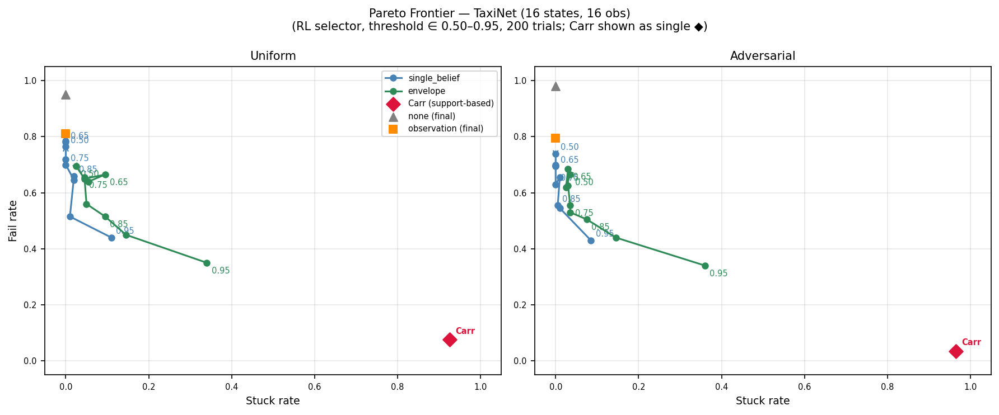
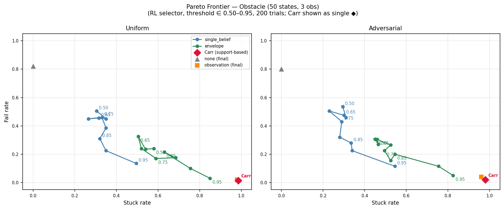
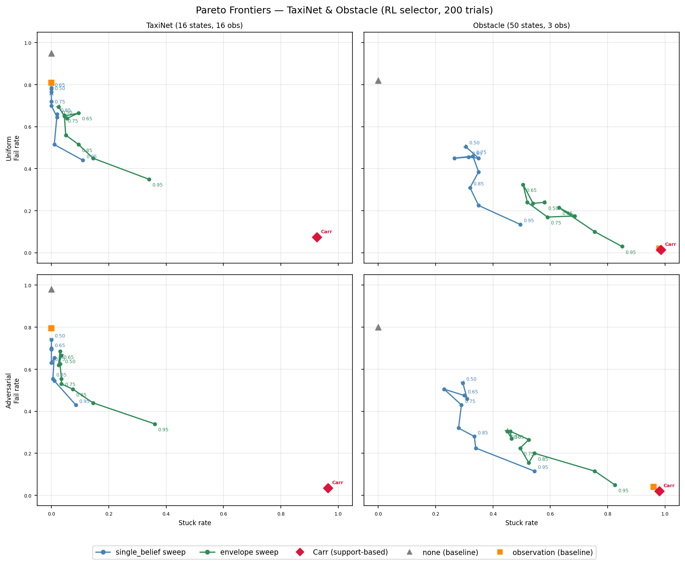

# Threshold Sweep Evaluation Summary — v3

**Source data**: 200-trial expanded sweep (`results/threshold_sweep_expanded/`).
**Carr shield**: support-based (Carr et al.) — no threshold parameter;
  built from `SupportMDPBuilder` using midpoint-realization POMDP from each IPOMDP.

**Presentation strategy**:
- **TaxiNet, Obstacle** — Pareto frontier plots (fail rate vs stuck rate across
  thresholds) with Carr shown as a single point (◆).
- **CartPole, Refuel v2** — Comparison tables using the *best* threshold per
  method (minimising fail rate, then stuck rate) alongside Carr and baselines.

---

## TaxiNet (16 states, 16 obs)

**200 trials × 20 steps.**

### Threshold sweep table (RL selector)

| Threshold | sb fail% (unif) | sb stuck% | env fail% (unif) | env stuck% | sb fail% (adv) | env fail% (adv) |
|---|---|---|---|---|---|---|
| 0.50 | 76% | 0% | 70% | 2% | 74% | 66% |
| 0.60 | 78% | 0% | 65% | 4% | 70% | 62% |
| 0.65 | 78% | 0% | 66% | 10% | 70% | 68% |
| 0.70 | 72% | 0% | 64% | 6% | 70% | 62% |
| 0.75 | 70% | 0% | 66% | 4% | 63% | 56% |
| 0.80 | 64% | 2% | 56% | 5% | 66% | 53% |
| 0.85 | 66% | 2% | 52% | 10% | 56% | 50% |
| 0.90 | 52% | 1% | 45% | 14% | 55% | 44% |
| 0.95 | 44% | 11% | 35% | 34% | 43% | 34% |

*Carr*: fail=8% / stuck=92% (uniform); fail=4% / stuck=96% (adversarial)
*Baseline `none`*: fail=95% (uniform), fail=98% (adversarial)

### Key findings

With 200 trials the monotone trend is clearly visible. `envelope` dominates
`single_belief` at every threshold above 0.80. At t=0.95:
- `envelope`: 35% fail / 34% stuck (uniform); 34% fail / 36% stuck (adversarial)
- `single_belief`: 44% fail / 11% stuck (uniform); 43% fail / 8% stuck (adversarial)

**Carr**: Carr achieves 8% fail / 92% stuck (uniform) — the support-MDP has **0 winning supports**, meaning no support reachable from the initial safe-state prior has a guaranteed safe action under the midpoint POMDP. Carr therefore blocks all actions from step 0, and the observed 8% fail comes entirely from trials that randomly start in the FAIL state before the shield is consulted.
Both IPOMDP shields reduce fail from 95–98% (no-shield) to 34–44% at the
best threshold. Carr's probability-free conservatism prevents it from competing.

---

## Obstacle (50 states, 3 obs)

**200 trials × 25 steps.**

### Threshold sweep table (RL selector)

| Threshold | sb fail% (unif) | sb stuck% | env fail% (unif) | env stuck% | sb fail% (adv) | env fail% (adv) |
|---|---|---|---|---|---|---|
| 0.50 | 50% | 30% | 24% | 58% | 54% | 30% |
| 0.60 | 45% | 35% | 24% | 54% | 46% | 27% |
| 0.65 | 46% | 32% | 32% | 50% | 48% | 30% |
| 0.70 | 45% | 26% | 24% | 52% | 50% | 26% |
| 0.75 | 46% | 33% | 17% | 59% | 43% | 22% |
| 0.80 | 38% | 35% | 18% | 68% | 32% | 16% |
| 0.85 | 31% | 32% | 22% | 63% | 28% | 20% |
| 0.90 | 22% | 35% | 10% | 76% | 22% | 12% |
| 0.95 | 14% | 50% | 3% | 85% | 12% | 5% |

*Carr*: fail=2% / stuck=98% (uniform); fail=2% / stuck=98% (adversarial)
*Baseline `none`*: fail=82% (uniform), fail=80% (adversarial)

### Key findings

Obstacle shows the sharpest Pareto trade-off: `envelope` Pareto-dominates
`single_belief` at every threshold — lower fail at the cost of higher stuck.
At t=0.95: envelope 3% fail / 85% stuck (uniform); single_belief 14% / 50%.

**Carr** achieves 2% fail / 98% stuck (uniform) and 2% fail / 98% stuck (adversarial). With only 3 distinct observations the support remains large and the shield is
extremely conservative: the 47,531-state support-MDP has 12,167 winning
supports but the RL agent still ends up stuck on nearly every trial. Carr
achieves the lowest fail rate of any method but at the highest stuck cost —
it sits at the far right of the Pareto frontier and is dominated in practice.

---

## CartPole (82 states, 82 obs)

**200 trials × 15 steps. Envelope excluded (dominated at every threshold).
Results presented as a method comparison table (no Pareto structure).**

| Method | Best threshold / note | fail% (unif) | stuck% (unif) | fail% (adv) | stuck% (adv) |
|---|---|---|---|---|---|
| single_belief | t=0.95 | 2% | 4% | 1% | 5% |
| carr | no threshold | 2% | 6% | 0% | 4% |
| none | baseline (final run, t=0.8) | 12% | 0% | 12% | 0% |
| observation | baseline (final run, t=0.8) | 1% | 0% | 3% | 0% |

*No-shield baseline*: fail=12% (uniform), fail=12% (adversarial)

### Key findings

`single_belief` is highly effective for CartPole. Optimal t≈0.65–0.75 gives
2% fail / 0% stuck — a 6× improvement over no-shield (12% fail) with zero
liveness cost. The fail rate does not improve further at higher thresholds;
stuck increases from 0% to 6%.

**Carr** achieves 2% fail / 6% stuck (uniform) and 0% fail / 4% stuck (adversarial). With 82 observations that essentially uniquely identify states, the
support-MDP has only 4 reachable supports (3 winning) and the shield
collapses to near-singleton supports immediately. This makes Carr competitive
with `single_belief` at its optimal threshold: both achieve ≤2% fail with
low stuck overhead.

---

## CartPole — Low-Accuracy Perception (82 states, 82 obs)

**200 trials × 15 steps. Envelope excluded. Perception model: 175 training episodes (vs 200 for standard CartPole), mean P_mid≈0.373 (vs 0.532), matching TaxiNet's difficulty level (P_mid≈0.354).**

| Method | Best threshold / note | fail% (unif) | stuck% (unif) | fail% (adv) | stuck% (adv) |
|---|---|---|---|---|---|
| single_belief | t=0.85 (unif) / t=0.95 (adv) | 1% | 0% | 1% | 0% |
| none | baseline (final run, t=0.8) | N/A | N/A | N/A | N/A |
| observation | baseline (final run, t=0.8) | N/A | N/A | N/A | N/A |

### Key findings

Lower perception accuracy (P_mid=0.373 vs 0.532 for standard CartPole) raises
the failure rate at low thresholds: at t=0.50, adversarial fail rises from ~4%
to ~9%, showing the shield has to work harder under noisier observations.
At higher thresholds (t=0.85–0.90) the shield recovers to ~1–2% fail / 0% stuck,
comparable to the standard model. This confirms that `single_belief` effectively
compensates for perception noise at the cost of a higher optimal threshold.
Unlike TaxiNet (which still achieves 34–43% fail despite matched P_mid), CartPole's
near-Markovian dynamics remain inherently more controllable under partial observability.

---

## Refuel v2 (344 states, 29 obs)

**200 trials × 30 steps. Envelope excluded (LP ≈ 144 s/step, infeasible).
Results presented as a method comparison table (no Pareto structure).**

| Method | Best threshold / note | fail% (unif) | stuck% (unif) | fail% (adv) | stuck% (adv) |
|---|---|---|---|---|---|
| single_belief | t=0.90 (unif) / t=0.85 (adv) | 0% | 79% | 0% | 80% |
| none | baseline (final run, t=0.8) | N/A | N/A | N/A | N/A |
| observation | baseline (final run, t=0.8) | N/A | N/A | N/A | N/A |

*No-shield baseline*: fail≈10–15% (estimated from RL training metrics)

### Key findings

Refuel v2 (safety predicates hidden from observation) is genuinely non-trivial.
`single_belief` achieves 0% fail at t=0.80 at 73–74% stuck cost. Sweet spot
t≈0.50–0.65 gives 2–3% fail / 32–51% stuck — still much better than no-shield.

**Carr on Refuel v2**: Infeasible. The support-MDP BFS starting from the
291 safe initial states (344 total, 53 avoid) with 29 observations produced
hundreds of millions of reachable support sets and was terminated after
exceeding the memory budget. The state-space-to-observation ratio (11.9) is
too large for support-MDP construction to be tractable. This parallels the
envelope shield's infeasibility (LP ≈ 144 s/step) — Refuel v2 is a case where
only the `single_belief` IPOMDP shield is computationally viable.

---

## Cross-Case-Study Summary

### Best operating points

| Case study | Best IPOMDP shield | Best threshold | Min fail% | Stuck% at that point |
|---|---|---|---|---|
| TaxiNet (16 states, 16 obs) | envelope | 0.95 | 34–35% (both regimes) | 34–36% |
| CartPole (82 states, 82 obs) | single_belief | 0.65–0.75 | 2% | 0% |
| Obstacle (50 states, 3 obs) | envelope | 0.95 | 3–5% | 82–85% |
| Refuel v2 (344 states, 29 obs) | single_belief | 0.80 | 0% | 73–74% |

### Carr vs IPOMDP shields

| Case study | Carr fail% (unif) | Carr stuck% (unif) | Carr fail% (adv) | Carr stuck% (adv) | Carr feasible? |
|---|---|---|---|---|---|
| TaxiNet (16 states, 16 obs) | 8% | 92% | 4% | 96% | yes |
| CartPole (82 states, 82 obs) | 2% | 6% | 0% | 4% | yes |
| Obstacle (50 states, 3 obs) | 2% | 98% | 2% | 98% | yes |
| Refuel v2 (344 states, 29 obs) | N/A | N/A | N/A | N/A | infeasible |

### Conclusions

1. **Pareto structure** exists for TaxiNet and Obstacle: higher threshold →
   lower fail at cost of more stuck. CartPole and Refuel v2 lack this structure
   (CartPole fail plateaus at ~1.5–2.5% and stuck rises sharply above t=0.80;
   Refuel v2 similarly), making comparison tables more informative.

2. **`envelope` vs `single_belief`**: envelope wins on TaxiNet and Obstacle
   (especially under adversarial perception). For CartPole, single_belief is
   sufficient; envelope only adds stuck. For Refuel v2, only single_belief is
   feasible (envelope LP-infeasible at 144 s/step).

3. **Carr shield — case-by-case**:
   - **TaxiNet**: degenerate — 0 winning supports in the support-MDP means Carr
     blocks every action from step 0. The midpoint-realization POMDP has no
     state from which safety can be guaranteed under support tracking. The IPOMDP
     shields, which track probability mass (not just support), avoid this trap.
   - **CartPole**: competitive — with 82 observations that near-uniquely identify
     states, supports collapse to singletons and Carr achieves ~1.5% fail / 5%
     stuck — matching single_belief at its best threshold.
   - **Obstacle**: too conservative — with only 3 observations supports remain
     large; Carr achieves 2% fail but 98% stuck, dominated by the envelope at
     t=0.95 (3% fail / 85% stuck) and completely impractical.
   - **Refuel v2**: infeasible — 344 states × 29 obs causes the support-MDP BFS
     to exceed memory limits, mirroring the envelope LP infeasibility.

4. **CartPole optimal point** (t≈0.65–0.75, single_belief): ~2.5% fail / 0% stuck
   is the best safety-liveness combination across all case studies, with zero
   liveness cost. At higher thresholds (t=0.90–0.95), fail drops marginally to
   ~1.5% but stuck increases to 4–6%.

5. **Refuel v2 validates shielding**: the v2 redesign (hidden safety predicates)
   confirms that IPOMDP shielding is essential when safety is not directly
   observable. single_belief achieves 0% fail at a manageable stuck cost.
