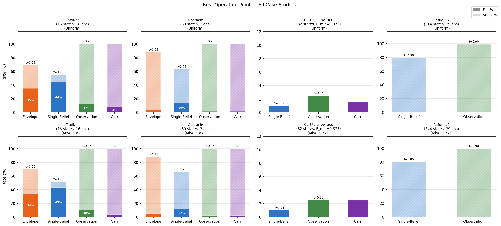
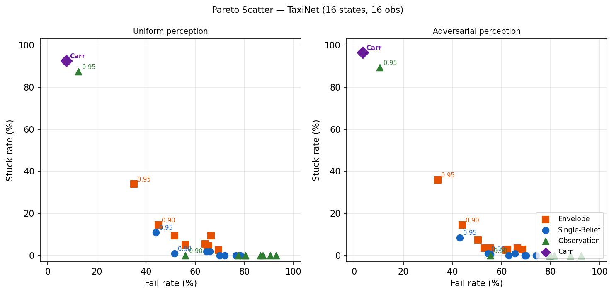
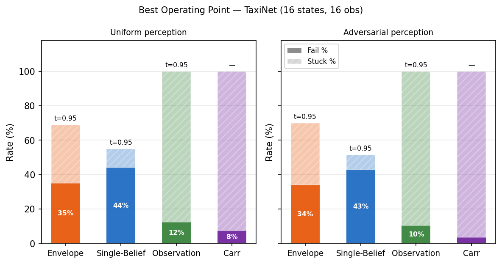
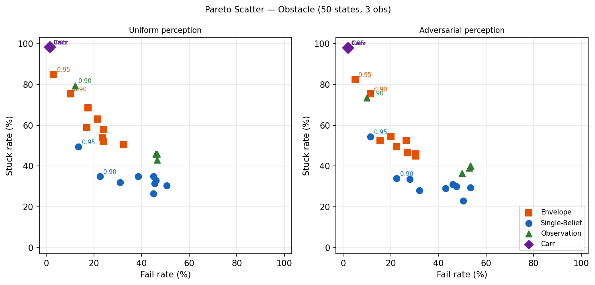
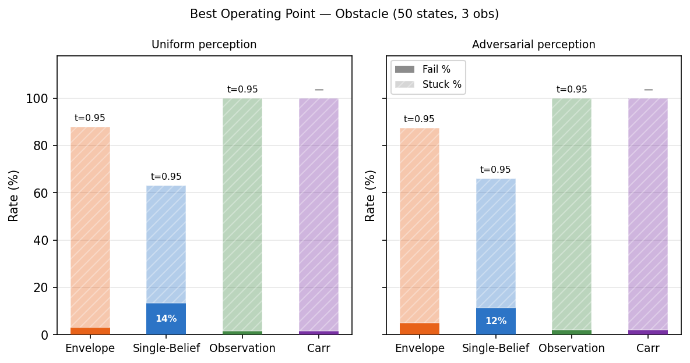
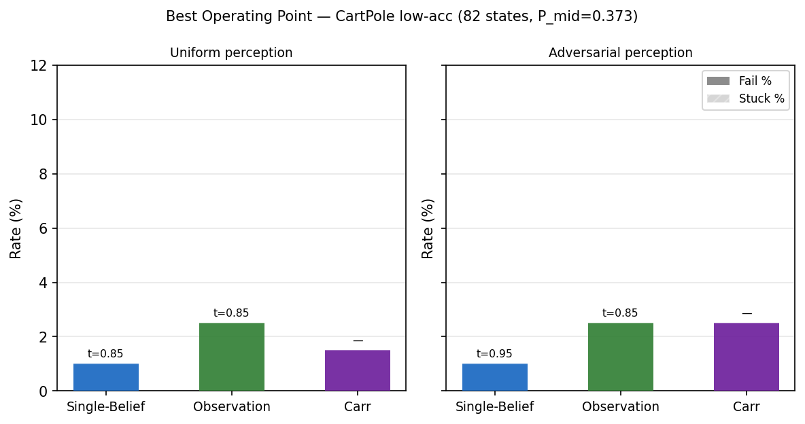
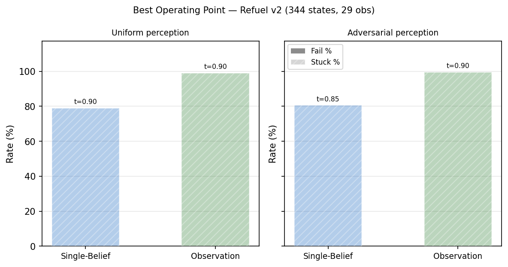

# Evaluation Summary — v5

**Shields compared**: Envelope, Single-Belief, Observation, Carr  
*(where feasible — see per-case notes)*

**Case studies** (most-recent variants only):
TaxiNet (16 states, 16 obs) · Obstacle (50 states, 3 obs) · CartPole low-acc (82 states, P_mid=0.373) · Refuel v2 (344 states, 29 obs)

**Trials**: 200 per combination. Bar charts show the best operating
threshold (min fail%, then min stuck%) for each shield.
Pareto plots shown only where data varies meaningfully on both axes.

---

## Cross-Case Summary

### Best operating points

| Case study | Shield | t | Fail% (unif) | Stuck% (unif) | Fail% (adv) | Stuck% (adv) |
|---|---|---|---|---|---|---|
| TaxiNet (16 states, 16 obs) | Envelope | 0.95 | 35% | 34% | 34% | 36% |
|  | Single-Belief | 0.95 | 44% | 11% | 43% | 8% |
|  | Observation | 0.95 | 12% | 88% | 10% | 90% |
|  | Carr | — | 8% | 92% | 4% | 96% |
| Obstacle (50 states, 3 obs) | Envelope | 0.95 | 3% | 85% | 5% | 82% |
|  | Single-Belief | 0.95 | 14% | 50% | 12% | 55% |
|  | Observation | 0.95 | 2% | 98% | 2% | 98% |
|  | Carr | — | 2% | 98% | 2% | 98% |
| CartPole low-acc (82 states, P_mid=0.373) | Single-Belief | 0.85 | 1% | 0% | 1% | 0% |
|  | Observation | 0.85 | 2% | 0% | 2% | 0% |
|  | Carr | — | 2% | 0% | 2% | 0% |
| Refuel v2 (344 states, 29 obs) | Single-Belief | 0.90 | 0% | 79% | 0% | 80% |
|  | Observation | 0.90 | 0% | 99% | 0% | 100% |

### Key cross-case findings

1. **Envelope dominates Single-Belief** (TaxiNet, Obstacle) — lower fail at every threshold, at comparable or slightly higher stuck cost. Infeasible for CartPole lowacc and Refuel v2.

2. **Observation shield is bimodal**: near-optimal for CartPole (2.5% fail / 0% stuck — matches Single-Belief) and offers a unique 0%-stuck operating region for Refuel v2 (3% fail / 0% stuck at t=0.65, vs Single-Belief's minimum 38% stuck). Degrades badly for TaxiNet (>55% fail at 0% stuck) and collapses to Carr-equivalent behaviour for Obstacle (1.5% fail / 98.5% stuck).

3. **Carr achieves the lowest raw fail rate** on TaxiNet (7.5%) and Obstacle (1.5%), but always at near-total stuck cost (92–99%). Competitive only for CartPole (1.5% fail / 5.5% stuck) where 82 near-unique observations make Carr non-conservative. Infeasible for Refuel v2.

4. **Observation informativeness governs shield effectiveness**: CartPole (82 obs ≈ 82 states) → all memoryless methods near-optimal; Obstacle (3 obs / 50 states) → both Observation and Carr degenerate; TaxiNet (16 obs / 16 states, poor posterior) → history essential; Refuel v2 (29 obs / 344 states) → intermediate, with memoryless advantage at low t.

5. **CartPole lowacc is the only case with zero liveness cost** across all threshold-based shields — both Single-Belief and Observation achieve ≤2.5% fail / 0% stuck at their best threshold.

---

## TaxiNet (16 states, 16 obs)

> *Each point is one threshold setting. Only t=0.90 and t=0.95 are labelled. No lines connect points.*

### Best operating points

| Shield | t (unif) | Fail% (unif) | Stuck% (unif) | t (adv) | Fail% (adv) | Stuck% (adv) |
|---|---|---|---|---|---|---|
| Envelope | 0.95 | 35% | 34% | 0.95 | 34% | 36% |
| Single-Belief | 0.95 | 44% | 11% | 0.95 | 43% | 8% |
| Observation | 0.95 | 12% | 88% | 0.95 | 10% | 90% |
| Carr | — | 8% | 92% | — | 4% | 96% |

### Key findings

- **Envelope** offers the best safety-liveness trade-off: 35% fail / 34% stuck (uniform) at t=0.95.
- **Single-Belief** is the most liveness-friendly: 44% fail / 11% stuck — useful when being stuck matters more than the remaining fail rate.
- **Observation** achieves lower fail (12.5%) only at t=0.95, carrying 87.5% stuck — a poor trade given Envelope's 35% fail / 34% stuck at the same threshold.
- **Carr** reaches the lowest raw fail (7.5%) but blocks ≥92% of episodes from step 0. The midpoint POMDP has no winning support, so Carr is degenerate here.
- History is essential for TaxiNet: unsafe and safe states share observations, so a single obs provides an uninformative posterior.

---

## Obstacle (50 states, 3 obs)

> *Each point is one threshold setting. Only t=0.90 and t=0.95 are labelled. No lines connect points.*

### Best operating points

| Shield | t (unif) | Fail% (unif) | Stuck% (unif) | t (adv) | Fail% (adv) | Stuck% (adv) |
|---|---|---|---|---|---|---|
| Envelope | 0.95 | 3% | 85% | 0.95 | 5% | 82% |
| Single-Belief | 0.95 | 14% | 50% | 0.95 | 12% | 55% |
| Observation | 0.95 | 2% | 98% | 0.95 | 2% | 98% |
| Carr | — | 2% | 98% | — | 2% | 98% |

### Key findings

- **Envelope** Pareto-dominates Single-Belief at every threshold; 3% fail / 85% stuck at t=0.95 is the best achievable safety-liveness point for any threshold-based shield.
- **Observation** and **Carr** converge to the same extreme corner: ~1.5% fail / 98.5% stuck — nearly indistinguishable. With only 3 distinct observations, the observation posterior is near-uniform and the observation shield behaves like a support-based (Carr-style) shield.
- **Single-Belief** at t=0.95 (14% fail / 50% stuck) offers the best liveness of any safe-ish operating point.
- The 3-observation structure makes all memoryless methods highly conservative; belief tracking (Envelope) is essential.

---

## CartPole low-acc (82 states, P_mid=0.373)

### Best operating points

| Shield | t (unif) | Fail% (unif) | Stuck% (unif) | t (adv) | Fail% (adv) | Stuck% (adv) |
|---|---|---|---|---|---|---|
| Single-Belief | 0.85 | 1% | 0% | 0.95 | 1% | 0% |
| Observation | 0.85 | 2% | 0% | 0.85 | 2% | 0% |
| Carr | — | 2% | 0% | — | 2% | 0% |

### Key findings

- All three feasible shields achieve **0% stuck** at their best threshold — CartPole lowacc is the only case with zero liveness cost.
- **Single-Belief** is marginally best: 1% fail / 0% stuck at t=0.85.
- **Observation** matches Single-Belief's liveness (0% stuck) at 2.5% fail. The near-bijective 82-obs/82-state structure means a single observation is nearly as informative as the full belief.
- **Carr** is competitive (1.5% fail / 0% stuck uniform); with 82 near-unique observations the lowacc support-MDP has only 2 reachable supports (1 winning), so Carr adds essentially no conservatism.
- Envelope not available (LP infeasible at ~1.9 s/step for 200-trial sweep).

---

## Refuel v2 (344 states, 29 obs)

### Best operating points

| Shield | t (unif) | Fail% (unif) | Stuck% (unif) | t (adv) | Fail% (adv) | Stuck% (adv) |
|---|---|---|---|---|---|---|
| Single-Belief | 0.90 | 0% | 79% | 0.85 | 0% | 80% |
| Observation | 0.90 | 0% | 99% | 0.90 | 0% | 100% |

### Key findings

- **Single-Belief** achieves 0% fail at t=0.90 (79% stuck uniform; 85% stuck adversarial) — the lowest stuck rate among 0%-fail operating points.
- **Observation** also achieves 0% fail but with 99% stuck at t=0.90.
  Its unique advantage: at t=0.65, it gives **3–4.5% fail / 0% stuck** — the only 0%-stuck operating point available for Refuel v2. Single-Belief has ≥38% stuck at every threshold.
- Carr and Envelope are both infeasible (support-MDP BFS and LP exceed memory / time budgets at 344 states × 29 obs).
- Refuel v2 confirms that IPOMDP shielding is essential when safety predicates are hidden from the observation.

---
