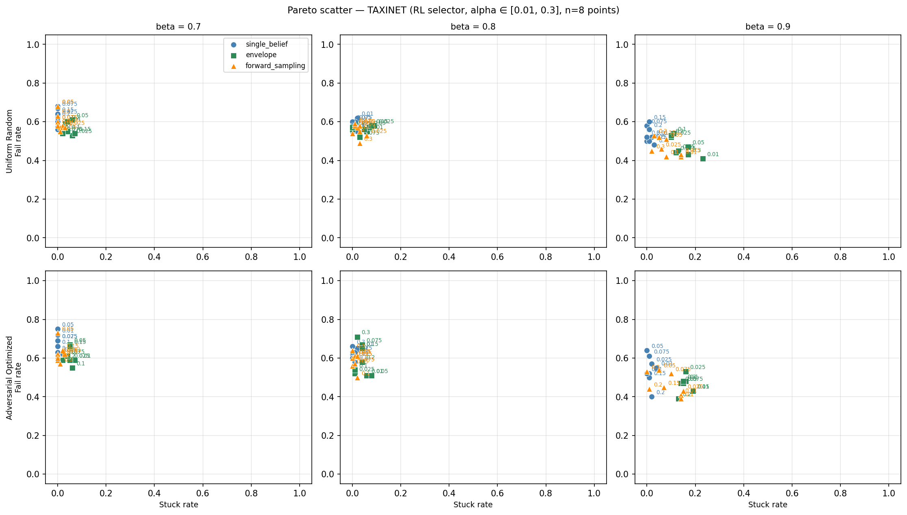
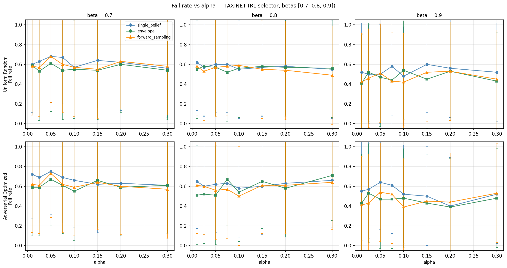
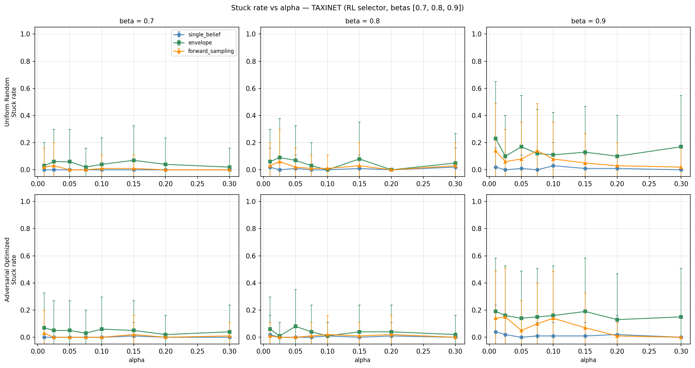

# Alpha Sweep: TaxiNet Pareto Frontier (multi-beta, 5 seeds)

Expanded version of the alpha sweep on TaxiNet. The CI significance `alpha`
is scanned over 8 values, evaluated at 3 shield thresholds
`beta ∈ {0.7, 0.8, 0.9}` to expose how the alpha–metric relationship
depends on shield conservatism.

- `alpha`: Clopper-Pearson significance level. Smaller `alpha` → wider
  intervals → more uncertainty acknowledged → more conservative shielding.
- `beta`: runtime shield safety threshold. Larger `beta` → more conservative
  (more actions blocked, more "stuck" states).

**Settings**: 8 alphas × 3 betas × 5 seeds × 20 trials × 20 steps ×
3 shields × 2 perception regimes = **720 MC cells, 14,400 trials,
288,000 trial-steps**. 100 trials per (alpha, beta, perception, shield)
cell. Forward-sampling shield uses `budget=500`, `K_samples=100`.
Adversarial realizations are trained against the `envelope` shield at each
`beta` and reused for the other shields at the same `beta`.

**Total runtime**: 5,949 s (≈ 99 min). All 8 RL agents and all 24
adversarial realizations were loaded from cache (trained in the prior
3-seed sweep), so this run was MC-trials-only.

---

## Pareto scatter



*Rows: perception regime (uniform / adversarial-optimized).
Cols: shield threshold (beta = 0.7, 0.8, 0.9).
Marker shape: shield (○ single_belief, ■ envelope, ▲ forward_sampling).
Each point is one alpha value (annotated). Lines intentionally omitted to
keep the scatter as the geometric summary.*

## Alpha trends




*Error bars: ±1 std across all 100 trials per cell. For binary trial
outcomes this collapses to sqrt(p·(1−p)), so the bars reflect inherent
trial-to-trial dispersion (peaks near 0.5 when p ≈ 0.5), not the
uncertainty of the mean.*

---

## Headline findings

1. **Beta is the dominant knob, not alpha.** Across all three betas and
   both perception regimes, per-shield fail rates move within a roughly
   10–20 pp band as alpha varies, with no consistent monotone trend. In
   contrast, moving from beta = 0.7 → 0.9 shifts the operating point
   from the "all-fail / no-stuck" corner to a real fail-vs-stuck trade-off:
   envelope/forward_sampling stuck rates jump from < 9% at beta ≤ 0.8 to
   1–23% at beta = 0.9, while fail rates drop by 10–25 pp.
2. **Alpha trend is essentially flat at low/medium beta.** At beta = 0.7
   and beta = 0.8 the alpha-vs-fail curves are noisy but trendless
   (per-shield fail rates stay near 50–70%, stuck < 10%). With 100 trials
   per cell the cell-to-cell variation across alphas is comparable to a
   single binomial SE (~5 pp at p ≈ 0.6).
3. **A weak alpha effect appears at beta = 0.9.** The most conservative
   beta is where alpha starts to matter:
   - Envelope and forward_sampling fail rates trend down by ~5–10 pp as
     alpha rises from 0.01 to 0.3 (most visible under adversarial
     perception).
   - Stuck rates stay roughly flat at 10–20% — alpha mainly moves fail
     here, with stuck dominated by the high beta itself.
4. **Forward-sampling and envelope tie for best adversarial fail at high
   beta.** Best single operating points in the entire grid under
   adversarial perception, beta = 0.9: `envelope` at alpha = 0.20 →
   39% fail / 13% stuck, and `forward_sampling` at alpha = 0.10 →
   39% fail / 14% stuck. `single_belief` reaches 40% fail / 2% stuck at
   the same (beta = 0.9, alpha = 0.20) — a nearly identical fail rate
   with a much lower stuck rate.
5. **Single-belief keeps the "no stuck" guarantee everywhere.** Across all
   144 (alpha, beta, perception) cells `single_belief` never exceeds 4%
   stuck. Its fail rate is consistently 5–15 pp higher than
   envelope/forward_sampling at low/medium beta but the gap closes at
   beta = 0.9. It is the unambiguous choice when stuck is unacceptable.

---

## Per-perception, per-beta tables

Cells show `fail% / stuck%` (mean across 100 trials per cell = 5 seeds ×
20 trials). Bold = best (lowest fail) within row.

### Uniform perception

#### beta = 0.7
| alpha | single_belief | envelope        | forward_sampling |
|-------|---------------|-----------------|------------------|
| 0.010 | 60 / 0        | 59 / 3          | **58 / 2**       |
| 0.025 | 63 / 0        | **53 / 6**      | 57 / 3           |
| 0.050 | 68 / 0        | **61 / 6**      | 68 / 0           |
| 0.075 | 67 / 0        | **54 / 2**      | 60 / 0           |
| 0.100 | 57 / 0        | **55 / 4**      | 57 / 1           |
| 0.150 | 64 / 0        | **54 / 7**      | 55 / 1           |
| 0.200 | 62 / 0        | **60 / 4**      | 63 / 0           |
| 0.300 | 56 / 0        | **54 / 2**      | 58 / 0           |

#### beta = 0.8
| alpha | single_belief | envelope        | forward_sampling |
|-------|---------------|-----------------|------------------|
| 0.010 | 62 / 2        | **55 / 6**      | 58 / 3           |
| 0.025 | 57 / 0        | 58 / 9          | **53 / 6**       |
| 0.050 | 60 / 1        | **57 / 7**      | **57 / 2**       |
| 0.075 | 60 / 0        | **52 / 3**      | 58 / 1           |
| 0.100 | **55 / 0**    | 56 / 0          | 59 / 1           |
| 0.150 | 57 / 1        | 58 / 8          | **55 / 3**       |
| 0.200 | 58 / 0        | 57 / 0          | **54 / 0**       |
| 0.300 | 55 / 2        | 56 / 5          | **49 / 3**       |

#### beta = 0.9
| alpha | single_belief | envelope        | forward_sampling |
|-------|---------------|-----------------|------------------|
| 0.010 | 52 / 2        | **41 / 23**     | 42 / 14          |
| 0.025 | 50 / 0        | 52 / 10         | **46 / 6**       |
| 0.050 | 50 / 1        | **47 / 17**     | 51 / 8           |
| 0.075 | 58 / 0        | 44 / 12         | **43 / 14**      |
| 0.100 | 48 / 3        | 54 / 11         | **42 / 8**       |
| 0.150 | 60 / 1        | **45 / 13**     | 52 / 5           |
| 0.200 | 56 / 1        | **53 / 10**     | **53 / 3**       |
| 0.300 | 52 / 0        | **43 / 17**     | 45 / 2           |

### Adversarial perception

#### beta = 0.7
| alpha | single_belief | envelope        | forward_sampling |
|-------|---------------|-----------------|------------------|
| 0.010 | 72 / 0        | **59 / 7**      | 62 / 3           |
| 0.025 | 69 / 0        | **59 / 5**      | 61 / 0           |
| 0.050 | 75 / 0        | **67 / 5**      | 73 / 0           |
| 0.075 | 69 / 0        | **61 / 3**      | 62 / 0           |
| 0.100 | 66 / 0        | **55 / 6**      | 59 / 0           |
| 0.150 | **62 / 1**    | 66 / 5          | 64 / 2           |
| 0.200 | 63 / 0        | **59 / 2**      | 60 / 0           |
| 0.300 | 61 / 0        | 61 / 4          | **57 / 1**       |

#### beta = 0.8
| alpha | single_belief | envelope        | forward_sampling |
|-------|---------------|-----------------|------------------|
| 0.010 | 65 / 2        | **51 / 6**      | 61 / 1           |
| 0.025 | 60 / 0        | **52 / 1**      | 60 / 0           |
| 0.050 | 62 / 0        | **51 / 8**      | 56 / 0           |
| 0.075 | 63 / 0        | 67 / 4          | **57 / 1**       |
| 0.100 | 58 / 1        | 54 / 1          | **50 / 2**       |
| 0.150 | **60 / 0**    | 65 / 4          | 61 / 1           |
| 0.200 | 63 / 1        | **58 / 4**      | 61 / 2           |
| 0.300 | 66 / 0        | 71 / 2          | **64 / 0**       |

#### beta = 0.9
| alpha | single_belief | envelope        | forward_sampling |
|-------|---------------|-----------------|------------------|
| 0.010 | 55 / 4        | 43 / 19         | **41 / 14**      |
| 0.025 | 57 / 2        | 53 / 16         | **43 / 15**      |
| 0.050 | 64 / 0        | **47 / 14**     | 54 / 5           |
| 0.075 | 61 / 1        | **47 / 15**     | 52 / 10          |
| 0.100 | 52 / 1        | 48 / 16         | **39 / 14**      |
| 0.150 | 50 / 1        | **43 / 19**     | 45 / 7           |
| 0.200 | 40 / 2        | **39 / 13**     | 44 / 1           |
| 0.300 | 52 / 0        | **48 / 15**     | 53 / 0           |

---

## Observations on the alpha–metric trend

- **Beta = 0.7, 0.8 (permissive shielding):** alpha is essentially a knob
  that does not move the metrics. The Clopper-Pearson intervals are wide
  enough at any of these alphas that the shield decisions are dominated by
  the worst-case bound; tightening alpha changes the bound modestly
  relative to the noise floor. The Pareto cloud is tightly packed in the
  upper-left region of (low stuck, high fail).
- **Beta = 0.9 (conservative shielding):** the alpha effect becomes
  measurable but small. Larger alpha (tighter intervals) slightly *reduces*
  fail rate for `envelope` and `forward_sampling` under adversarial
  perception, presumably because the shield rejects fewer borderline
  actions and the RL policy then has access to better moves. `single_belief`
  is essentially flat in alpha at every beta — it never blocks enough to
  matter.
- **Stuck-vs-alpha is flat** for every shield at every beta. The stuck
  level is set by `(shield, beta)`, not by alpha.

---

## Key takeaways

1. **Tune beta first, alpha second.** Beta controls *which corner* of the
   Pareto plot you operate in; alpha is a fine adjustment within that
   corner.
2. **Forward-sampling and envelope are tied for best adversarial fail at
   high beta** (~39% fail at beta = 0.9 with α ∈ {0.10, 0.20}), but
   single_belief reaches the same fail rate (40%) at α = 0.20 with only
   2% stuck — a clearly dominant operating point if stuck must stay low.
3. **Single-belief is the right shield if stuck must be near zero.** It is
   ≤ 4% stuck in every cell, at the cost of higher fail (5–15 pp at low
   beta; ~0 pp at high beta).
4. **Statistical context.** Pooled trial-level std for binary outcomes is
   sqrt(p(1−p)); on the plots this peaks near 0.5 when p ≈ 0.5. For the
   *mean*, the binomial standard error on n = 100 trials is
   sqrt(p(1−p)/100) ≈ 5 pp at p ≈ 0.6 — so within-shield alpha trends
   on the order of 5 pp sit at the edge of significance, but the larger
   cross-shield and cross-beta orderings are robust.

## Limitations

- Adversarial realizations are trained against the `envelope` shield at
  each beta. They are reused unchanged when evaluating `single_belief` and
  `forward_sampling`; this likely under-estimates the worst case for those
  two shields.
- Adversarial realizations were trained in the prior 3-seed run; this
  rerun did not retrain them. If you want the realizations themselves to
  be re-optimized at higher fidelity, delete the
  `cache_alpha*_beta*_opt_realization.json` files and rerun.

## Reproducibility

```bash
python3 -m ipomdp_shielding.experiments.sweeps.rl_alpha_sweep
# config: ipomdp_shielding/experiments/sweeps/rl_alpha_sweep_taxinet.py
# outputs: data/sweep/rl_alpha_taxinet_v2/
#   results_tidy.csv, sweep_summary.json, figures/{pareto_alpha,alpha_vs_fail,alpha_vs_stuck}.png
```

Tidy CSV: `results_tidy.csv`
JSON (full metadata + per-cell aggregates): `sweep_summary.json`
