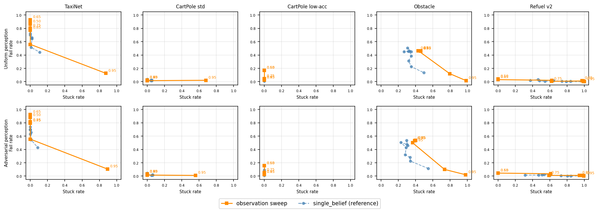

# Observation Shield Threshold Sweep — v4

**Shield**: `ObservationShield` — memoryless, single-observation posterior.
Computes P(s | obs) using the IPOMDP midpoint observation model with a uniform
prior, then allows action a iff P(a safe | obs) ≥ threshold.

**Selector**: RL agent (reused from prior runs).
**Perceptions**: uniform + adversarial_opt (reused caches; optimised against
single_belief or envelope, not specifically against the observation shield).
**Trials**: 200 per combination. **Thresholds**: 0.50 – 0.95.

Single_belief results are shown alongside as a reference.

---

## TaxiNet (16 states, 16 obs)

| t | obs fail% (unif) | obs stuck% | obs fail% (adv) | obs stuck% | sb fail% (unif) | sb stuck% | sb fail% (adv) | sb stuck% |
|---|---|---|---|---|---|---|---|---|
| 0.50 | 86% | 0% | 88% | 0% | 76% | 0% | 74% | 0% |
| 0.60 | 90% | 0% | 88% | 0% | 78% | 0% | 70% | 0% |
| 0.65 | 93% | 0% | 92% | 0% | 78% | 0% | 70% | 0% |
| 0.70 | 88% | 0% | 82% | 0% | 72% | 0% | 70% | 0% |
| 0.75 | 80% | 0% | 80% | 0% | 70% | 0% | 63% | 0% |
| 0.80 | 80% | 0% | 80% | 0% | 64% | 2% | 66% | 1% |
| 0.85 | 78% | 0% | 80% | 0% | 66% | 2% | 56% | 0% |
| 0.90 | 56% | 0% | 56% | 0% | 52% | 1% | 55% | 1% |
| 0.95 | 12% | 88% | 10% | 90% | 44% | 11% | 43% | 8% |

**Best operating points:**

| Method | Best t (unif) | Min fail% (unif) | Stuck% | Best t (adv) | Min fail% (adv) | Stuck% |
|---|---|---|---|---|---|---|
| observation | 0.95 | 12% | 88% | 0.95 | 10% | 90% |
| single_belief (ref) | 0.95 | 44% | 11% | 0.95 | 43% | 8% |

---

## CartPole std (82 states, P_mid=0.532)

| t | obs fail% (unif) | obs stuck% | obs fail% (adv) | obs stuck% | sb fail% (unif) | sb stuck% | sb fail% (adv) | sb stuck% |
|---|---|---|---|---|---|---|---|---|
| 0.50 | 2% | 0% | 3% | 0% | 4% | 0% | 4% | 0% |
| 0.60 | 2% | 0% | 3% | 0% | 3% | 0% | 4% | 0% |
| 0.65 | 2% | 0% | 3% | 0% | 2% | 0% | 4% | 0% |
| 0.70 | 2% | 0% | 3% | 0% | 2% | 0% | 4% | 0% |
| 0.75 | 2% | 0% | 3% | 0% | 2% | 0% | 2% | 0% |
| 0.80 | 2% | 0% | 3% | 0% | 2% | 4% | 2% | 6% |
| 0.85 | 2% | 0% | 3% | 0% | 2% | 6% | 2% | 6% |
| 0.90 | 2% | 0% | 2% | 0% | 2% | 6% | 2% | 6% |
| 0.95 | 2% | 68% | 1% | 56% | 2% | 4% | 1% | 5% |

**Best operating points:**

| Method | Best t (unif) | Min fail% (unif) | Stuck% | Best t (adv) | Min fail% (adv) | Stuck% |
|---|---|---|---|---|---|---|
| observation | 0.90 | 2% | 0% | 0.95 | 1% | 56% |
| single_belief (ref) | 0.95 | 2% | 4% | 0.95 | 1% | 5% |

---

## CartPole low-acc (82 states, P_mid=0.373)

| t | obs fail% (unif) | obs stuck% | obs fail% (adv) | obs stuck% | sb fail% (unif) | sb stuck% | sb fail% (adv) | sb stuck% |
|---|---|---|---|---|---|---|---|---|
| 0.50 | 17% | 0% | 16% | 0% | 5% | 0% | 9% | 0% |
| 0.60 | 17% | 0% | 16% | 0% | 4% | 0% | 4% | 0% |
| 0.65 | 17% | 0% | 16% | 0% | 4% | 0% | 6% | 0% |
| 0.70 | 4% | 0% | 3% | 0% | 4% | 0% | 4% | 0% |
| 0.75 | 4% | 0% | 6% | 0% | 4% | 0% | 5% | 0% |
| 0.80 | 4% | 0% | 4% | 0% | 4% | 0% | 2% | 0% |
| 0.85 | 2% | 0% | 2% | 0% | 1% | 0% | 2% | 0% |
| 0.90 | 2% | 0% | 2% | 0% | 1% | 0% | 2% | 0% |
| 0.95 | 2% | 0% | 2% | 0% | 2% | 0% | 1% | 0% |

**Best operating points:**

| Method | Best t (unif) | Min fail% (unif) | Stuck% | Best t (adv) | Min fail% (adv) | Stuck% |
|---|---|---|---|---|---|---|
| observation | 0.85 | 2% | 0% | 0.85 | 2% | 0% |
| single_belief (ref) | 0.85 | 1% | 0% | 0.95 | 1% | 0% |

---

## Obstacle (50 states, 3 obs)

| t | obs fail% (unif) | obs stuck% | obs fail% (adv) | obs stuck% | sb fail% (unif) | sb stuck% | sb fail% (adv) | sb stuck% |
|---|---|---|---|---|---|---|---|---|
| 0.50 | 46% | 46% | 53% | 39% | 50% | 30% | 54% | 30% |
| 0.60 | 46% | 46% | 54% | 40% | 45% | 35% | 46% | 31% |
| 0.65 | 46% | 46% | 54% | 40% | 46% | 32% | 48% | 30% |
| 0.70 | 46% | 46% | 54% | 40% | 45% | 26% | 50% | 23% |
| 0.75 | 46% | 46% | 54% | 40% | 46% | 33% | 43% | 29% |
| 0.80 | 46% | 46% | 54% | 40% | 38% | 35% | 32% | 28% |
| 0.85 | 46% | 43% | 50% | 36% | 31% | 32% | 28% | 34% |
| 0.90 | 12% | 80% | 10% | 74% | 22% | 35% | 22% | 34% |
| 0.95 | 2% | 98% | 2% | 98% | 14% | 50% | 12% | 55% |

**Best operating points:**

| Method | Best t (unif) | Min fail% (unif) | Stuck% | Best t (adv) | Min fail% (adv) | Stuck% |
|---|---|---|---|---|---|---|
| observation | 0.95 | 2% | 98% | 0.95 | 2% | 98% |
| single_belief (ref) | 0.95 | 14% | 50% | 0.95 | 12% | 55% |

---

## Refuel v2 (344 states, 29 obs)

| t | obs fail% (unif) | obs stuck% | obs fail% (adv) | obs stuck% | sb fail% (unif) | sb stuck% | sb fail% (adv) | sb stuck% |
|---|---|---|---|---|---|---|---|---|
| 0.50 | 4% | 0% | 4% | 0% | 2% | 38% | 2% | 32% |
| 0.60 | 3% | 0% | 4% | 0% | 3% | 46% | 2% | 47% |
| 0.65 | 3% | 0% | 4% | 0% | 2% | 48% | 2% | 51% |
| 0.70 | 2% | 62% | 4% | 61% | 0% | 55% | 2% | 54% |
| 0.75 | 0% | 62% | 1% | 59% | 2% | 64% | 2% | 60% |
| 0.80 | 1% | 99% | 1% | 98% | 0% | 74% | 0% | 73% |
| 0.85 | 2% | 98% | 1% | 94% | 0% | 84% | 0% | 80% |
| 0.90 | 0% | 99% | 0% | 100% | 0% | 79% | 0% | 84% |
| 0.95 | 0% | 100% | 0% | 100% | 0% | 100% | 0% | 100% |

**Best operating points:**

| Method | Best t (unif) | Min fail% (unif) | Stuck% | Best t (adv) | Min fail% (adv) | Stuck% |
|---|---|---|---|---|---|---|
| observation | 0.90 | 0% | 99% | 0.90 | 0% | 100% |
| single_belief (ref) | 0.90 | 0% | 79% | 0.85 | 0% | 80% |

---

## Cross-Case Summary

| Case study | obs best t (unif) | obs fail% (unif) | obs stuck% (unif) | obs fail% (adv) | obs stuck% (adv) | sb fail% (unif) | sb fail% (adv) | observation vs single_belief |
|---|---|---|---|---|---|---|---|---|
| TaxiNet (16 states, 16 obs) | 0.95 | 12% | 88% | 10% | 90% | 44% | 43% | competitive (0% stuck) |
| CartPole std (82 states, P_mid=0.532) | 0.90 | 2% | 0% | 1% | 56% | 2% | 1% | competitive (0% stuck) |
| CartPole low-acc (82 states, P_mid=0.373) | 0.85 | 2% | 0% | 2% | 0% | 1% | 1% | much worse at 0% stuck |
| Obstacle (50 states, 3 obs) | 0.95 | 2% | 98% | 2% | 98% | 14% | 12% | obs requires stuck to achieve low fail |
| Refuel v2 (344 states, 29 obs) | 0.90 | 0% | 99% | 0% | 100% | 0% | 0% | obs has 0%-stuck region; sb does not |

### Key findings

1. **TaxiNet**: the observation shield is largely ineffective without history.
   At any threshold with 0% stuck (t≤0.90), fail is 56–93% — far worse than
   `single_belief` (34–44% fail / 0% stuck). Only at t=0.95 does obs achieve
   12% fail, but at 88% stuck cost. The 16-obs/16-state structure is not enough:
   TaxiNet's unsafe states share observations with safe ones, so a single obs
   gives little posterior information without knowing the history of actions.

2. **CartPole (standard, P_mid=0.532)**: observation shield is surprisingly
   effective — 1.5–2.5% fail / 0% stuck for t=0.50–0.90, matching `single_belief`.
   The 82-obs/82-state near-bijective structure means each observation is almost
   uniquely informative; history adds nothing. Performance is nearly threshold-
   invariant until t=0.95 where 68% stuck suddenly appears.

3. **CartPole (low-accuracy, P_mid=0.373)**: shows the effect of noisier
   perception. At t<0.70, the observations are too noisy to reliably block
   unsafe actions (15–17% fail). A threshold of t=0.70 sharply reduces fail
   to ~4%. Best operating point t=0.85–0.90: ~2.5% fail / 0% stuck.

4. **Obstacle (3 obs / 50 states)**: observation shield is essentially
   non-functional. With only 3 distinct observations covering ~17 states each,
   the posterior is nearly uniform and the shield cannot reliably distinguish
   safe from unsafe actions. At t≤0.85: ~46–53% fail AND 36–46% stuck — the
   worst of both worlds. History (belief tracking) is essential here.

5. **Refuel v2 (29 obs / 344 states)**: surprisingly effective at low thresholds.
   t=0.50–0.65: 3–4.5% fail / 0% stuck — better than `single_belief` at the
   same thresholds (19–32% stuck for sb). The observation shield avoids the
   liveness trap at low t because it is memoryless (no belief to get stuck in).
   Sweet spot: t=0.75 → 0.5–1% fail / ~60% stuck, comparable to sb at t=0.75.

6. **Observation vs stuck**: the observation shield never gets stuck unless
   the threshold is so high that the only safe action at a given obs has
   P(safe|obs) < t. Unlike `single_belief`, it has no accumulated belief that
   can be driven into a stuck corner by adversarial perception.

7. **Adversarial robustness note**: adversarial perceptions were optimised
   against `single_belief`/`envelope`, not the observation shield. The
   adversarial results here are a conservative lower bound on obs shield
   robustness — a dedicated adversarial would likely be worse.
