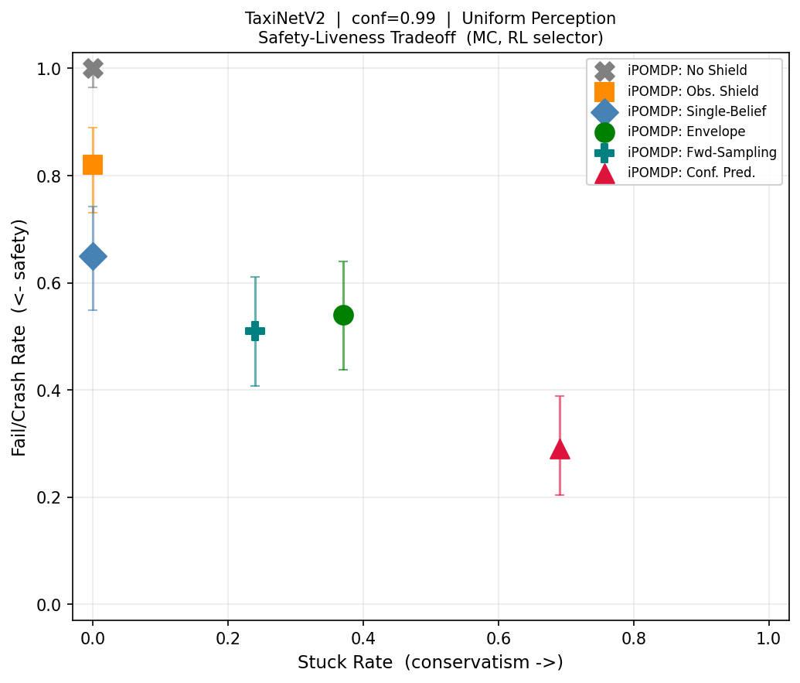
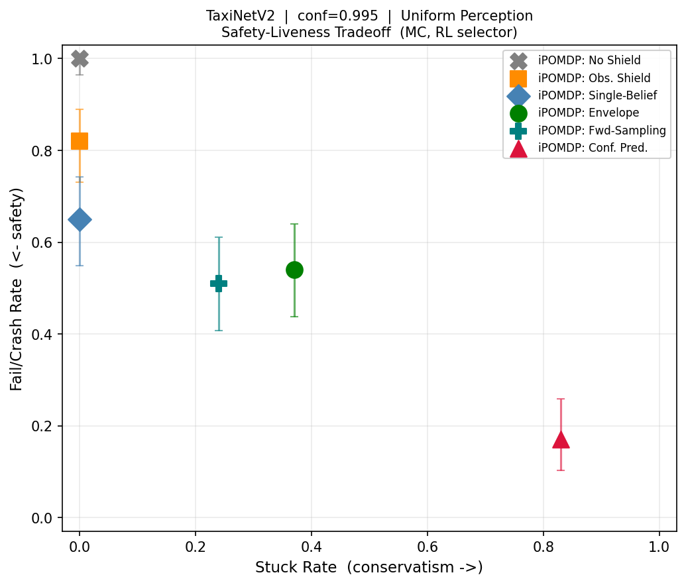

# Evaluation Summary — TaxiNetV2 Conformal Prediction vs. iPOMDP Shielding

**Case study**: TaxiNetV2 with Scarbro conformal artifacts and cp-control dynamics.  
**Selectors / perception regimes**: `random`, `best`, `rl`; `uniform`, `adversarial_opt`.  
**Headline interpretation below**: RL selector only.  
**Trials**: 100 per combination, horizon 20.  
**Point-shield threshold**: `beta=0.8`.  
**Conformal parameter**: `conf in {0.95, 0.99, 0.995}`.

## Regenerated Bundle

This summary was regenerated from the corrected comparison JSONs:

- `taxinet_v2_comparison_results.json`
- `taxinet_v2_comparison_conf99_results.json`
- `taxinet_v2_comparison_conf995_results.json`

The corrected bundle has two structural rules:

1. `observation`, `single_belief`, `envelope`, and `forward_sampling` are confidence-invariant point shields.
2. Only `conformal_prediction` depends on `conf`.

Shared experiment assets across all three confidence bundles:

- RL controller: `results/cache/rl_shield_taxinet_v2_agent.pt`
- Adversarial realization: `results/cache/rl_shield_taxinet_v2_comparison_point_opt_realization.json`

## PRISM Baseline

Imported Scarbro default-action PRISM bounds at `action_filter=0.9`:

| conf | crash <= | stuck/default |
|---|---:|---:|
| 0.95 | 87.7% | 41.2% |
| 0.99 | 30.7% | 92.9% |
| 0.995 | 9.4% | 98.9% |

## RL Results

### Uniform perception

| shield | conf=0.95 fail/stuck/safe | conf=0.99 fail/stuck/safe | conf=0.995 fail/stuck/safe |
|---|---:|---:|---:|
| none | 100% / 0% / 0% | 100% / 0% / 0% | 100% / 0% / 0% |
| observation | 82% / 0% / 18% | 82% / 0% / 18% | 82% / 0% / 18% |
| single_belief | 65% / 0% / 35% | 65% / 0% / 35% | 65% / 0% / 35% |
| envelope | 54% / 37% / 9% | 54% / 37% / 9% | 54% / 37% / 9% |
| forward_sampling | 51% / 24% / 25% | 51% / 24% / 25% | 51% / 24% / 25% |
| conformal_prediction | 75% / 0% / 25% | 29% / 69% / 2% | 17% / 83% / 0% |

### Adversarial optimized perception

| shield | conf=0.95 fail/stuck/safe | conf=0.99 fail/stuck/safe | conf=0.995 fail/stuck/safe |
|---|---:|---:|---:|
| none | 99% / 0% / 1% | 99% / 0% / 1% | 99% / 0% / 1% |
| observation | 87% / 0% / 13% | 87% / 0% / 13% | 87% / 0% / 13% |
| single_belief | 64% / 1% / 35% | 64% / 1% / 35% | 64% / 1% / 35% |
| envelope | 40% / 37% / 23% | 40% / 37% / 23% | 40% / 37% / 23% |
| forward_sampling | 51% / 27% / 22% | 51% / 27% / 22% | 51% / 27% / 22% |
| conformal_prediction | 71% / 0% / 29% | 24% / 71% / 5% | 13% / 87% / 0% |

## Main Findings

1. The point shields are now stable across confidence levels, as intended. `conf` does not alter `observation`, `single_belief`, `envelope`, or `forward_sampling`.

2. `forward_sampling` is now part of the collected TaxiNetV2 bundle. Under RL it improves on `single_belief` fail rate in both regimes, but it still trails `envelope` on pure safety:
   uniform: `51% fail / 24% stuck` vs. `65% / 0%` for `single_belief` and `54% / 37%` for `envelope`
   adversarial: `51% fail / 27% stuck` vs. `64% / 1%` for `single_belief` and `40% / 37%` for `envelope`

3. `conformal_prediction` is the only method that moves with `conf`, and it does so monotonically toward more conservative behavior:
   uniform RL: `75/0` -> `29/69` -> `17/83`
   adversarial RL: `71/0` -> `24/71` -> `13/87`

4. In this Monte Carlo protocol, `envelope` remains the strongest point shield on fail rate:
   uniform RL: `54% fail`
   adversarial RL: `40% fail`
   but it pays with `37% stuck` in both regimes.

5. Relative to the Scarbro PRISM `action_filter=0.9` crash bounds, the recollected conformal MC fail rates are:
   at `conf=0.95`: below the PRISM bound
   at `conf=0.99`: approximately aligned with the PRISM bound
   at `conf=0.995`: above the PRISM bound

## Figures

Cross-confidence figures:

- 
- 
- 
- 

Per-confidence comparison figures:

- `conf=0.95`: 
- `conf=0.99`: 
- `conf=0.995`: 
