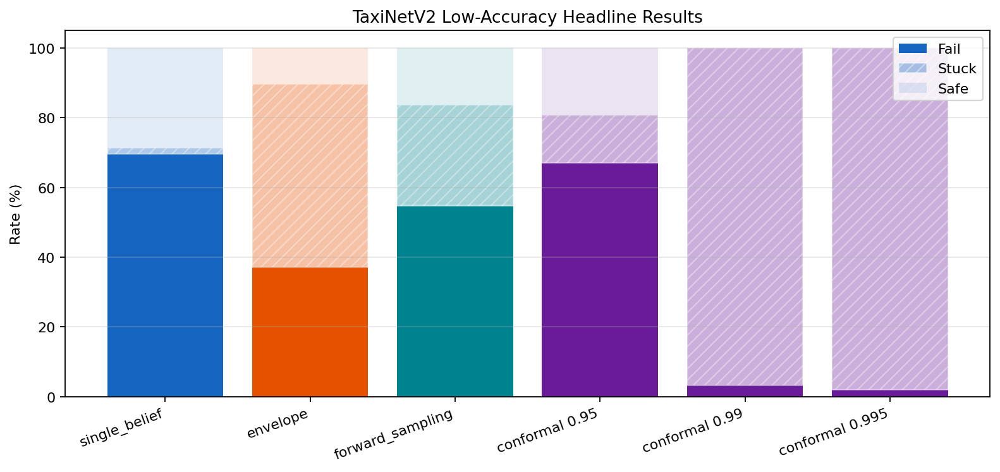
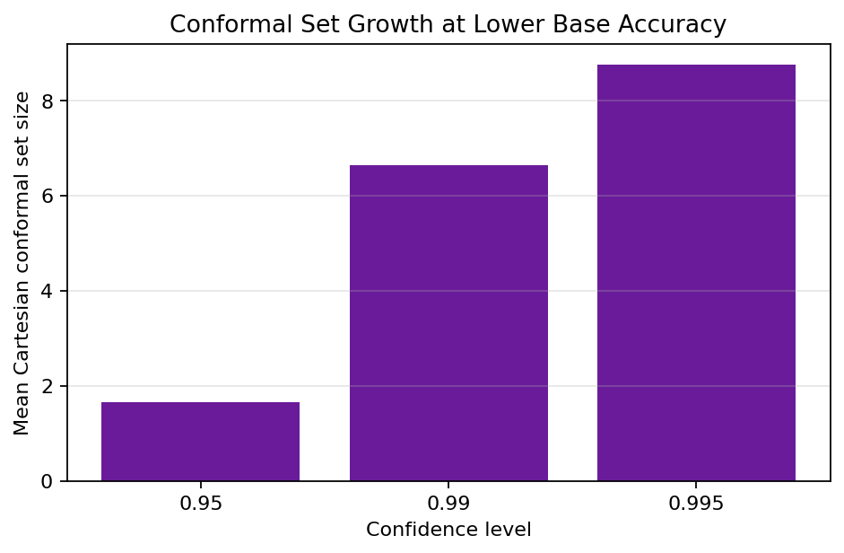
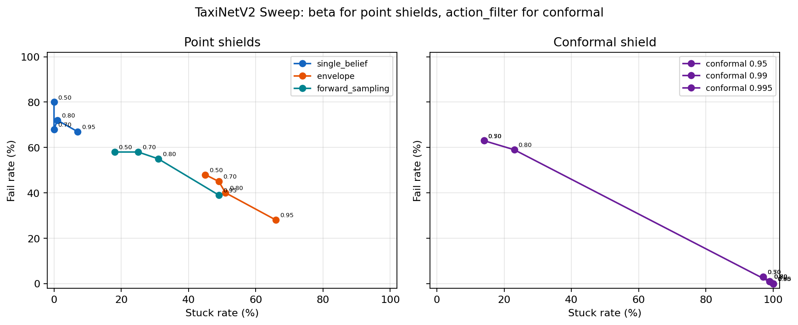
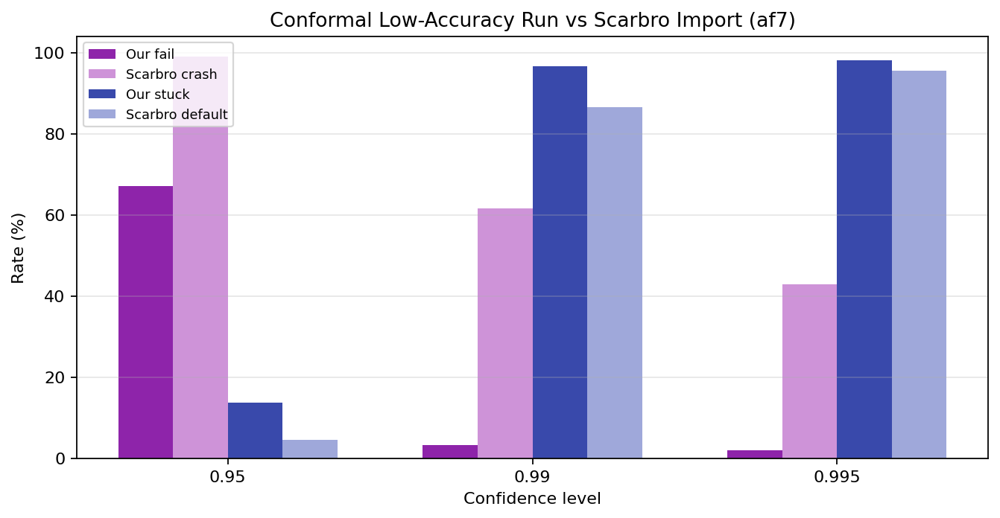

# TaxiNetV2 Low-Accuracy Evaluation Summary

## Setup

- Base checkpoint: `results/cache/taxinet_v2_lowacc_axis_noise_047_053/best_in_band_model.pth`
- Test accuracy: CTE `87.15%`, HE `93.09%`, joint `80.85%`
- Point estimate realization: `uniform` modular realization over the TaxiNetV2 point-estimate IPOMDP
- Headline run: `1000` trials, horizon `30`, initial state `safe`, point-shield beta `0.8`, conformal `action_filter=0.7`
- Beta sweep: `100` trials per operating point, beta/action-filter grid `[0.5, 0.7, 0.8, 0.95]`

## Headline Results

| Method | Fail | Stuck | Safe | Intervention |
|---|---:|---:|---:|---:|
| single_belief | 69.6% | 1.8% | 28.6% | 5.3% |
| envelope | 37.2% | 52.4% | 10.4% | 7.7% |
| forward_sampling | 54.7% | 28.9% | 16.4% | 7.0% |
| conformal 0.95 | 67.0% | 13.7% | 19.3% | 13.1% |
| conformal 0.99 | 3.3% | 96.7% | 0.0% | 50.1% |
| conformal 0.995 | 1.9% | 98.1% | 0.0% | 63.2% |

## Observations

- Lowering the base model accuracy to roughly `87/93` per axis moves conformal behavior into the intended regime: mean Cartesian set size rises from `1.66` at `0.95` to `8.75` at `0.995`.
- At the headline operating point, `0.99` and `0.995` conformal control are extremely conservative: fail falls to `3.3%` and `1.9%`, but stuck rises to `96.7%` and `98.1%`.
- The new sweep shows the usual beta tradeoff for point shields. At `beta=0.80`, envelope reaches fail `40.0%` / stuck `51.0%`. By `beta=0.95`, it shifts to fail `28.0%` / stuck `66.0%`.
- Sweeping conformal `action_filter` over the same numeric range gives a comparable Pareto curve, but the confidence level dominates behavior more strongly than the filter does. `0.95` remains usable; `0.99+` quickly collapses into near-total stuck behavior.

## Scarbro Comparison

| Confidence | Scarbro crash | Scarbro default | Our fail | Our stuck |
|---|---:|---:|---:|---:|
| 0.95 | 99.1% | 4.6% | 67.0% | 13.7% |
| 0.99 | 61.5% | 86.6% | 3.3% | 96.7% |
| 0.995 | 42.8% | 95.5% | 1.9% | 98.1% |

These are still not apples-to-apples with Scarbro et al.: their imported numbers are PRISM properties over a different controller/default-action semantics, while these are Monte Carlo RL-selector evaluations using the local paired-event artifact model.

## Figures

- Headline bars: 
- Conformal set sizes: 
- Beta/action-filter Pareto: 
- Scarbro comparison: 