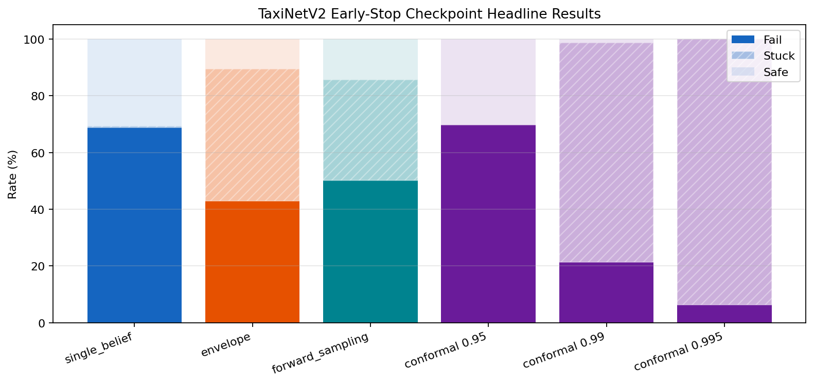
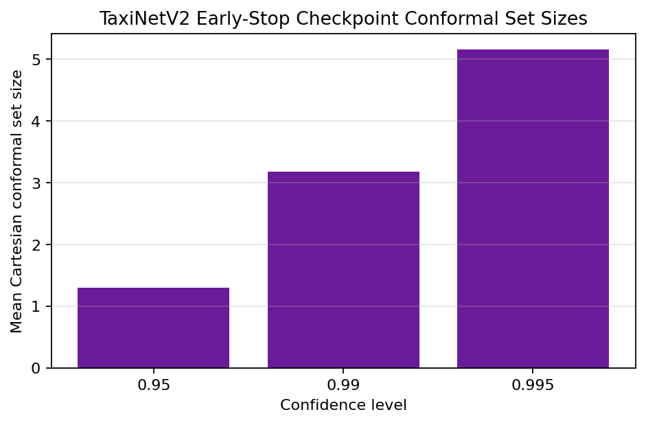
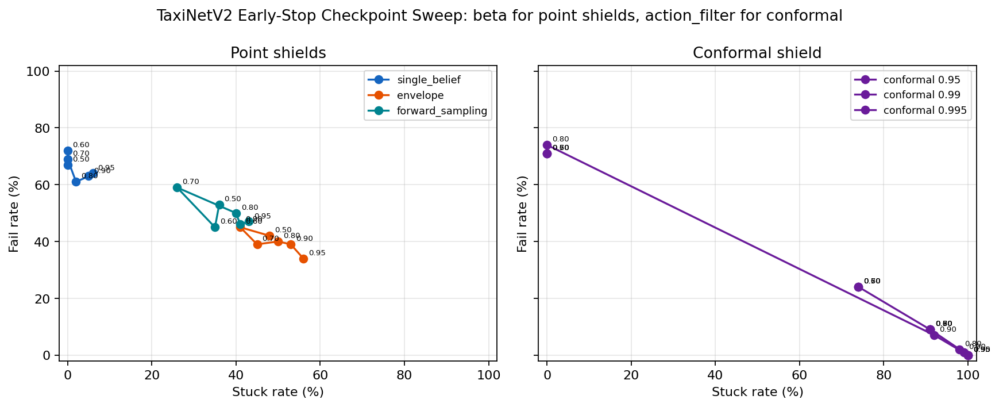
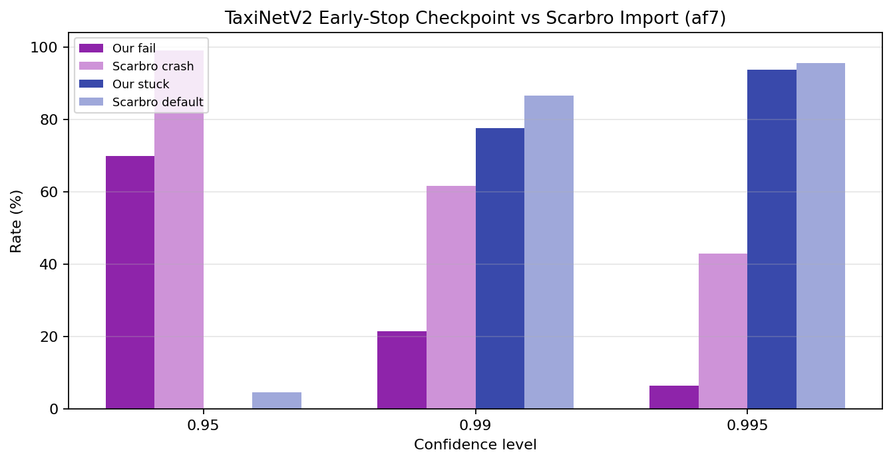

# TaxiNetV2 Early-Stop Checkpoint Evaluation Summary

Version: `v2026-05-12-earlystop-seed42`

## Setup

- Base checkpoint: `/home/dev/ipomdp_shielding/results/cache/taxinet_v2_earlystop_search_seed42/best_in_band_model.pth`
- Test accuracy: CTE `87.15%`, HE `96.73%`, joint `84.61%`
- Metadata accuracy echo: CTE `87.15%`, HE `96.73%`, joint `84.61%`
- Conformal mode: `shared-event/axis-paired`
- Point estimate realization: `uniform` modular realization over the TaxiNetV2 point-estimate IPOMDP
- Headline run: `1000` trials, horizon `30`, initial state `safe`, point-shield beta `0.8`, conformal `action_filter=0.7`
- Beta sweep: `100` trials per operating point, beta/action-filter grid `[0.5, 0.6, 0.7, 0.8, 0.9, 0.95]`

## Headline Results

| Method | Fail | Stuck | Safe | Intervention |
|---|---:|---:|---:|---:|
| single_belief | 68.9% | 0.5% | 30.6% | 4.6% |
| envelope | 42.9% | 46.6% | 10.5% | 5.9% |
| forward_sampling | 50.2% | 35.4% | 14.4% | 6.5% |
| conformal 0.95 | 69.8% | 0.0% | 30.2% | 5.3% |
| conformal 0.99 | 21.3% | 77.5% | 1.2% | 28.0% |
| conformal 0.995 | 6.3% | 93.7% | 0.0% | 50.3% |

## Observations

- Mean Cartesian conformal set size rises from `1.30` at `0.95` to `5.16` at `0.995`.
- At the headline operating point, `0.99` and `0.995` conformal control are extremely conservative: fail falls to `21.3%` and `6.3%`, but stuck rises to `77.5%` and `93.7%`.
- The new sweep shows the usual beta tradeoff for point shields. At `beta=0.80`, envelope reaches fail `40.0%` / stuck `50.0%`. By `beta=0.95`, it shifts to fail `34.0%` / stuck `56.0%`.
- Sweeping conformal `action_filter` over the same numeric range gives a comparable Pareto curve, but the confidence level dominates behavior more strongly than the filter does. `0.95` remains usable; `0.99+` quickly collapses into near-total stuck behavior.

## Scarbro Comparison

| Confidence | Scarbro crash | Scarbro default | Our fail | Our stuck |
|---|---:|---:|---:|---:|
| 0.95 | 99.1% | 4.6% | 69.8% | 0.0% |
| 0.99 | 61.5% | 86.6% | 21.3% | 77.5% |
| 0.995 | 42.8% | 95.5% | 6.3% | 93.7% |

These are still not apples-to-apples with Scarbro et al.: their imported numbers are PRISM properties over a different controller/default-action semantics, while these are Monte Carlo RL-selector evaluations using the local paired-event artifact model.

## Figures

- Headline bars: 
- Conformal set sizes: 
- Beta/action-filter Pareto: 
- Scarbro comparison: 
