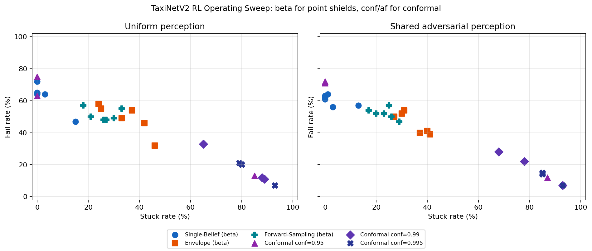
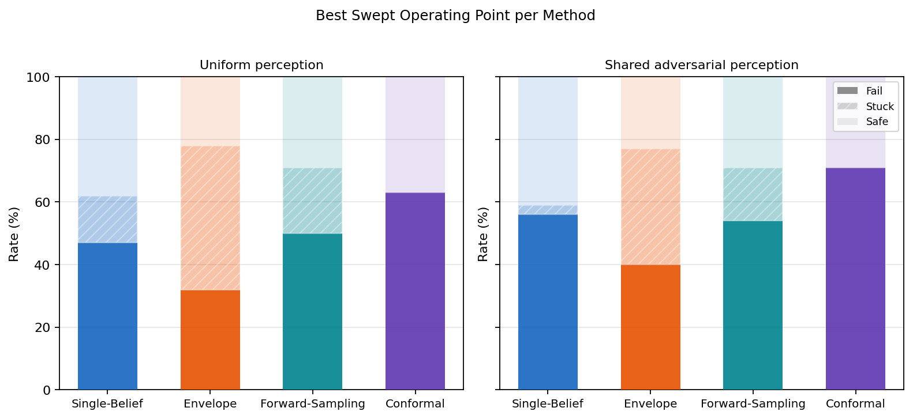

# TaxiNetV2 Operating Pareto Sweep

## Setup

- Selector: `rl` only.
- Shared RL controller cache: `ipomdp_shielding_/results/cache/rl_shield_taxinet_v2_agent.pt`.
- Shared adversarial realization cache: `ipomdp_shielding_/results/cache/rl_shield_taxinet_v2_comparison_point_opt_realization.json`.
- Beta grid for point shields: `[0.5, 0.6, 0.7, 0.8, 0.9, 0.95]`.
- Conformal confidence levels: `['0.95', '0.99', '0.995']`.
- Conformal action-filter grid: `[0.6, 0.7, 0.8, 0.9]`.
- Trials per point: `100` with horizon `20` and seed `42`.

## High-Level Findings

- Uniform lowest fail: `Conformal conf=0.995, af=0.9` at `7.0%` fail and `93.0%` stuck.
- Adversarial lowest fail: `Conformal conf=0.99, af=0.9` at `7.0%` fail and `93.0%` stuck.
- Uniform lowest stuck: `Single-Belief beta=0.50` at `0.0%` stuck and `64.0%` fail.
- Adversarial lowest stuck: `Single-Belief beta=0.50` at `0.0%` stuck and `61.0%` fail.
- Only the conformal shield moves with `conf` and `af`; `single_belief`, `envelope`, and `forward_sampling` move only with `beta`.
- The RL controller and adversarial realization are held fixed across the whole sweep, so the plotted differences are shield-operating-point differences rather than controller/retraining differences.
- In the stacked-bar figure, each method keeps only its highest-safe operating point, tie-broken by lower fail and then lower stuck.

## Best Point per Method

### Uniform perception

| Method | Setting | Fail | Stuck | Safe |
|---|---|---:|---:|---:|
| Single-Belief | `beta=0.95` | 47.0% | 15.0% | 38.0% |
| Envelope | `beta=0.90` | 32.0% | 46.0% | 22.0% |
| Forward-Sampling | `beta=0.70` | 50.0% | 21.0% | 29.0% |
| Conformal | `conf=0.95, af=0.8` | 63.0% | 0.0% | 37.0% |

### Shared adversarial perception

| Method | Setting | Fail | Stuck | Safe |
|---|---|---:|---:|---:|
| Single-Belief | `beta=0.90` | 56.0% | 3.0% | 41.0% |
| Envelope | `beta=0.80` | 40.0% | 37.0% | 23.0% |
| Forward-Sampling | `beta=0.50` | 54.0% | 17.0% | 29.0% |
| Conformal | `conf=0.95, af=0.6` | 71.0% | 0.0% | 29.0% |

## Uniform RL Results

| Operating point | Fail | Stuck | Safe | Intervention |
|---|---:|---:|---:|---:|
| Single-Belief beta=0.50 | 64.0% | 0.0% | 36.0% | 30.0% |
| Single-Belief beta=0.60 | 72.0% | 0.0% | 28.0% | 30.4% |
| Single-Belief beta=0.70 | 65.0% | 0.0% | 35.0% | 29.3% |
| Single-Belief beta=0.80 | 65.0% | 0.0% | 35.0% | 29.3% |
| Single-Belief beta=0.90 | 64.0% | 3.0% | 33.0% | 29.3% |
| Single-Belief beta=0.95 | 47.0% | 15.0% | 38.0% | 31.8% |
| Envelope beta=0.50 | 55.0% | 25.0% | 20.0% | 29.0% |
| Envelope beta=0.60 | 58.0% | 24.0% | 18.0% | 29.9% |
| Envelope beta=0.70 | 49.0% | 33.0% | 18.0% | 28.6% |
| Envelope beta=0.80 | 54.0% | 37.0% | 9.0% | 30.4% |
| Envelope beta=0.90 | 32.0% | 46.0% | 22.0% | 32.9% |
| Envelope beta=0.95 | 46.0% | 42.0% | 12.0% | 29.6% |
| Forward-Sampling beta=0.50 | 48.0% | 27.0% | 25.0% | 31.7% |
| Forward-Sampling beta=0.60 | 57.0% | 18.0% | 25.0% | 30.0% |
| Forward-Sampling beta=0.70 | 50.0% | 21.0% | 29.0% | 29.7% |
| Forward-Sampling beta=0.80 | 48.0% | 26.0% | 26.0% | 29.9% |
| Forward-Sampling beta=0.90 | 49.0% | 30.0% | 21.0% | 35.7% |
| Forward-Sampling beta=0.95 | 55.0% | 33.0% | 12.0% | 31.7% |
| Conformal conf=0.95, af=0.6 | 75.0% | 0.0% | 25.0% | 30.8% |
| Conformal conf=0.95, af=0.7 | 75.0% | 0.0% | 25.0% | 30.8% |
| Conformal conf=0.95, af=0.8 | 63.0% | 0.0% | 37.0% | 32.2% |
| Conformal conf=0.95, af=0.9 | 13.0% | 85.0% | 2.0% | 39.5% |
| Conformal conf=0.99, af=0.6 | 33.0% | 65.0% | 2.0% | 38.7% |
| Conformal conf=0.99, af=0.7 | 33.0% | 65.0% | 2.0% | 38.7% |
| Conformal conf=0.99, af=0.8 | 12.0% | 88.0% | 0.0% | 45.2% |
| Conformal conf=0.99, af=0.9 | 11.0% | 89.0% | 0.0% | 65.6% |
| Conformal conf=0.995, af=0.6 | 20.0% | 80.0% | 0.0% | 32.8% |
| Conformal conf=0.995, af=0.7 | 20.0% | 80.0% | 0.0% | 32.8% |
| Conformal conf=0.995, af=0.8 | 21.0% | 79.0% | 0.0% | 55.6% |
| Conformal conf=0.995, af=0.9 | 7.0% | 93.0% | 0.0% | 65.0% |

## Adversarial RL Results

| Operating point | Fail | Stuck | Safe | Intervention |
|---|---:|---:|---:|---:|
| Single-Belief beta=0.50 | 61.0% | 0.0% | 39.0% | 28.4% |
| Single-Belief beta=0.60 | 63.0% | 0.0% | 37.0% | 29.1% |
| Single-Belief beta=0.70 | 62.0% | 0.0% | 38.0% | 30.1% |
| Single-Belief beta=0.80 | 64.0% | 1.0% | 35.0% | 30.3% |
| Single-Belief beta=0.90 | 56.0% | 3.0% | 41.0% | 31.4% |
| Single-Belief beta=0.95 | 57.0% | 13.0% | 30.0% | 30.6% |
| Envelope beta=0.50 | 54.0% | 31.0% | 15.0% | 28.1% |
| Envelope beta=0.60 | 50.0% | 27.0% | 23.0% | 28.5% |
| Envelope beta=0.70 | 52.0% | 30.0% | 18.0% | 28.4% |
| Envelope beta=0.80 | 40.0% | 37.0% | 23.0% | 29.3% |
| Envelope beta=0.90 | 39.0% | 41.0% | 20.0% | 28.8% |
| Envelope beta=0.95 | 41.0% | 40.0% | 19.0% | 28.9% |
| Forward-Sampling beta=0.50 | 54.0% | 17.0% | 29.0% | 29.1% |
| Forward-Sampling beta=0.60 | 52.0% | 20.0% | 28.0% | 29.7% |
| Forward-Sampling beta=0.70 | 52.0% | 23.0% | 25.0% | 30.5% |
| Forward-Sampling beta=0.80 | 50.0% | 26.0% | 24.0% | 29.8% |
| Forward-Sampling beta=0.90 | 57.0% | 25.0% | 18.0% | 28.9% |
| Forward-Sampling beta=0.95 | 47.0% | 29.0% | 24.0% | 30.7% |
| Conformal conf=0.95, af=0.6 | 71.0% | 0.0% | 29.0% | 27.2% |
| Conformal conf=0.95, af=0.7 | 71.0% | 0.0% | 29.0% | 27.2% |
| Conformal conf=0.95, af=0.8 | 72.0% | 0.0% | 28.0% | 30.1% |
| Conformal conf=0.95, af=0.9 | 12.0% | 87.0% | 1.0% | 41.6% |
| Conformal conf=0.99, af=0.6 | 28.0% | 68.0% | 4.0% | 38.0% |
| Conformal conf=0.99, af=0.7 | 28.0% | 68.0% | 4.0% | 38.0% |
| Conformal conf=0.99, af=0.8 | 22.0% | 78.0% | 0.0% | 40.2% |
| Conformal conf=0.99, af=0.9 | 7.0% | 93.0% | 0.0% | 69.2% |
| Conformal conf=0.995, af=0.6 | 14.0% | 85.0% | 1.0% | 42.7% |
| Conformal conf=0.995, af=0.7 | 14.0% | 85.0% | 1.0% | 42.7% |
| Conformal conf=0.995, af=0.8 | 15.0% | 85.0% | 0.0% | 55.7% |
| Conformal conf=0.995, af=0.9 | 7.0% | 93.0% | 0.0% | 87.5% |

## Figure

- Pareto scatter: 
- Best-point bars: 